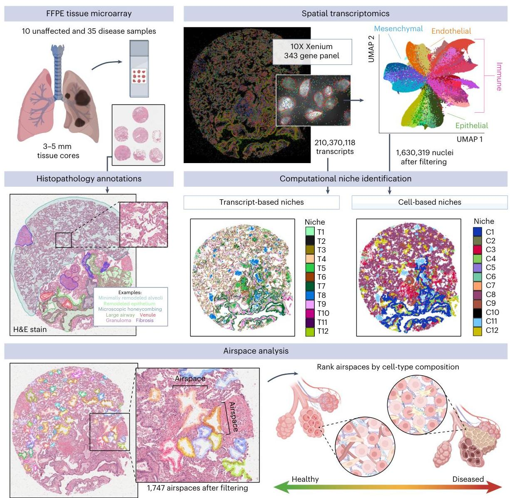
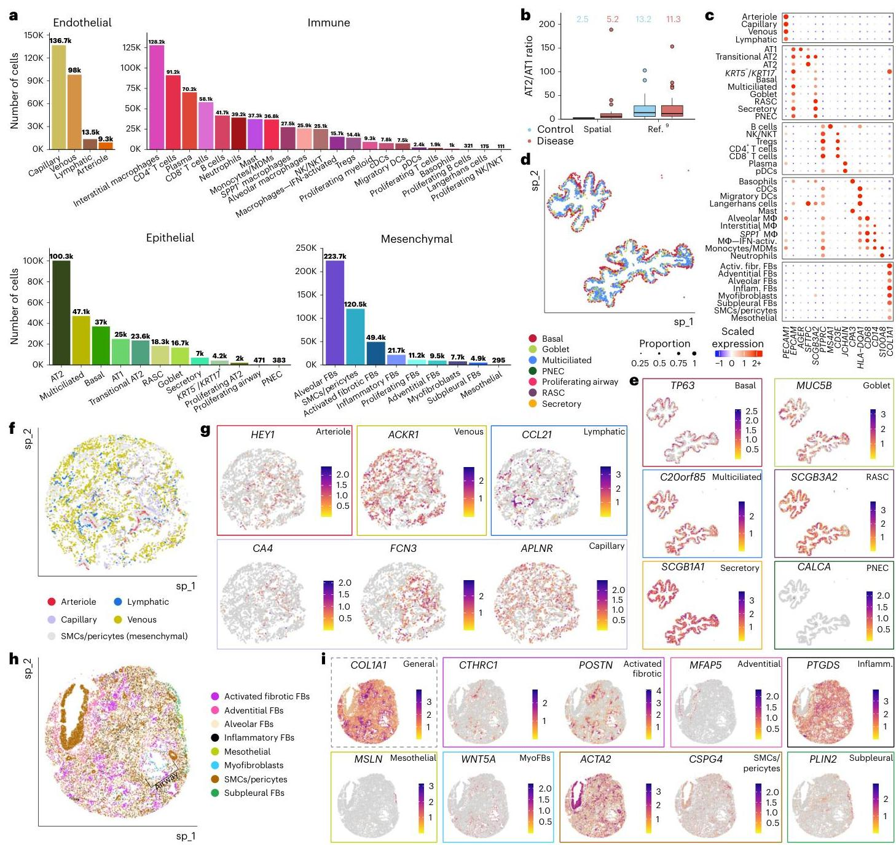
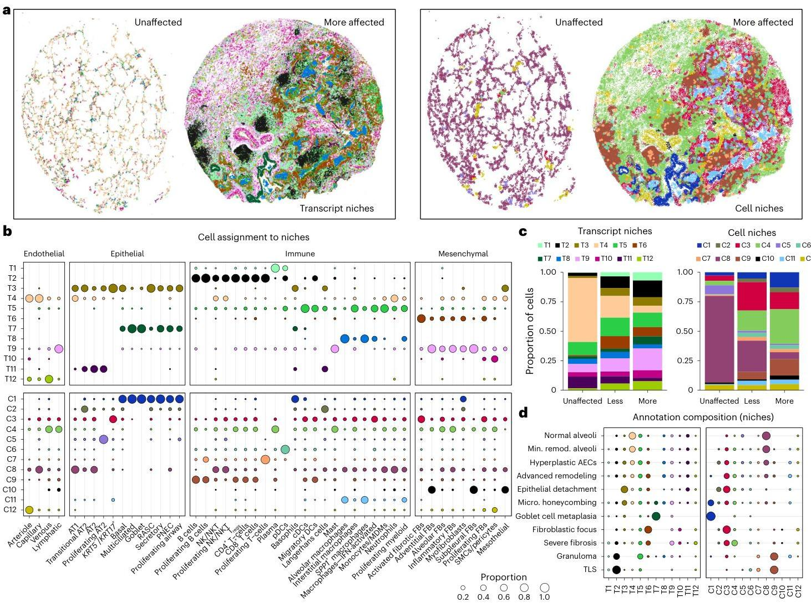
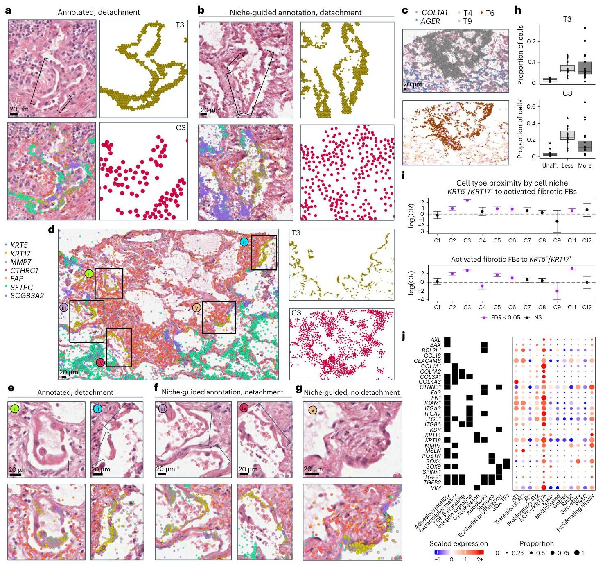
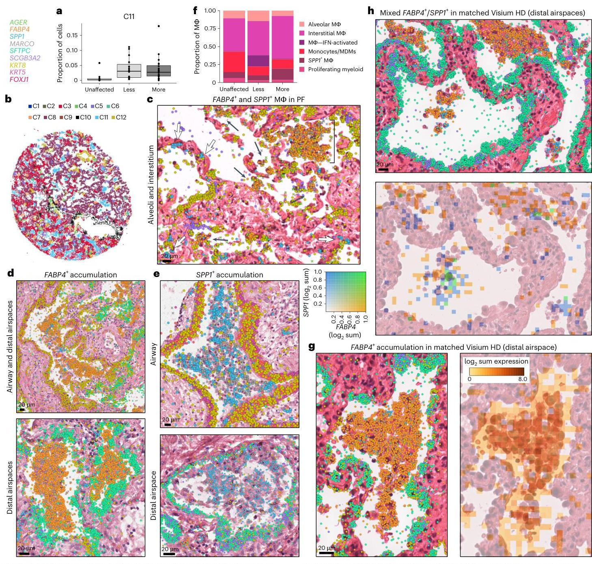
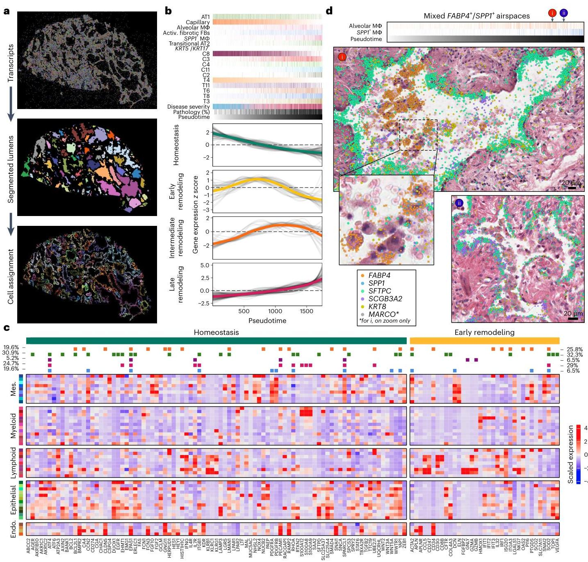

# Spatial Transcriptomics Identifies Molecular Niche Dysregulation Associated with Distal Lung Remodeling in Pulmonary Fibrosis

Spatial transcriptomics identifies molecular niche dysregulation associated with distal lung remodeling in pulmonary fibrosis

Received: 22 January 2024 Accepted: 8 January 2025 Published online: 3 February 2025 Check for updates

Annika Vannan[133], Ruqian Lyu[2,3,4,13], Arianna L. Williams[1], Nicholas M. Negretti[5], Evan D. Mee[1], Joseph Hirsh[5], Samuel Hirsh[5], Niran Hadad[1], David S. Nichols[6], Carla L. Calvi[6], Chase J. Taylor[6], Vasiliy V. Polosukhin[6], Ana P. M. Serezani[6], A. Scott McCall[6], Jason J. Gokey[6], Heejung Shim[3,4], Lorraine B. Ware[5,7], Matthew J. Bacchetta[8], Ciara M. Shaver[6], Timothy S. Blackwell[6,9,10,11], Rajat Walia[12], Jennifer M. S. Sucre[2,9], Jonathan A. Kropski[6,9,10,14], Davis J. McCarthy[2,3,4,14] & Nicholas E. Banovich[1,14]

Large-scale changes in the structure and cellular makeup of the distal lung are a hallmark of pulmonary fibrosis (PF), but the spatial contexts that contribute to disease pathogenesis have remained uncertain. Using image-based spatial transcriptomics, we analyzed the gene expression of 1.6 million cells from 35 unique lungs. Through complementary cell-based and innovative cell-agnostic analyses, we characterized the localization of PF-emergent cell types, established the cellular and molecular basis of classical PF histopathologic features and identified a diversity of distinct molecularly defined spatial niches in control and PF lungs. Using machine learning and trajectory analysis to segment and rank airspaces on a gradient of remodeling severity, we identified compositional and molecular changes associated with progressive distal lung pathology, beginning with alveolar epithelial dysregulation and culminating with changes in macrophage polarization. Together, these results provide a unique, spatially resolved view of PF and establish methods that could be applied to other spatial transcriptomic studies.

The human lung is structurally complex, with a diversity of specialized epithelial, stromal and immune cells having specific functional roles in anatomically distinct locations. Large-scale changes in the structure and cellular makeup of the distal lung are a hallmark of pulmonary fibrosis (PF) and other chronic lung diseases[1]. PF is a progressive syndrome that can occur in the setting of known environmental exposures, systemic disorders, monogenic syndromes or can be idiopathic. Idiopathic pulmonary fibrosis (IPF) remains the most common and severe form of PF; most patients succumb to their disease or require lung transplantation within 3-5 years of diagnosis, and available antifibrotic treatments only modestly slow the inexorable decline of lung function[2,3].

### A Hallmark of Histopathologic Findings in IPF Lungs

A hallmark of histopathologic findings in the lungs of patients with IPF (described as 'usual interstitial pneumonia") is spatial heterogeneity, where extensively remodeled regions can be found immediately adjacent to relatively preserved alveolar architecture. This spatial variability of pathology has been hypothesized to represent asynchronous disease evolution in the lung ('temporal heterogeneity'). In addition to the spatial heterogeneity of pathology, IPF lungs are characterized by the following: 'proximalized epithelial metaplasia', wherein cell types typically found in conducting airways are observed in the distal lung epithelium; development and accumulation of cystic-appearing structures filled with mucus (‘honeycomb cysts'); and the emergence of ‘fibroblastic foci' (subepithelial collections of fibroblasts), which have been speculated to represent the ‘leading edge' of disease pathology in the lung[5]. Along with genetic evidence linking IPF susceptibility to the lung epithelium[6-9] and data from experimental models, these classical histopathologic features support the prevailing model of IPF pathogenesis[10], whereby chronic/recurrent injury to the distal lung epithelium results in dysfunctional alveolar repair and culminates in progressive fibrotic remodeling.

### Single-Cell Approaches for Investigating Spatial Heterogeneity

Although the cellular complexity and spatial heterogeneity of disease present challenges when using bulk-tissue methods for genomic analysis, single-cell approaches are well-suited for such investigations. Large collaborative studies using droplet-based single-cell RNA sequencing (scRNA-seq) have refined our understanding of the cellular makeup of the normal human lung[11-14] and highlighted dramatic changes in the cellular makeup and molecular programs in IPF lungs, including disease-emergent and disease-perturbed cell types and states[9,15-18]. The spatial heterogeneity of pathology implies that within a given IPF lung, multiple distinct pathologic programs may be simultaneously occurring in distinct spatial regions (niches); thus, it is critical to understand the spatial context within which cellular and molecular programs mediate disease pathogenesis. To this end, we used image-based spatial transcriptomics with subcellular resolution to investigate the evolution of alveolar niche dysregulation in idiopathic and other forms of PF.

## Results

### Diverse cellular landscape of the lung

Using the Xenium platform, we profiled 343 genes across 45 lung tissue samples from nine unaffected donors and 26 participants who underwent lung transplant for PF, measuring 299,018,086 transcripts at subcellular resolution (Fig. 1, Supplementary Figs. 1 and 2 and Supplementary Table 1). Of the 26 PF participants, the most frequent diagnosis was IPF (n = 12, 46.2%). The majority of donors self-reported European ancestry (29; 82.9%), and 17 (48.6%) reported current or prior tobacco use. To enable spatially resolved single-cell analysis, we partitioned transcripts into cells using automated cell segmentation boundaries (Fig. 1). As cell segmentation remains a challenge in the field due to uncertainty around cellular boundaries and reliable assignment of transcripts to the correct cell, we focused only on transcripts overlapping nuclear boundaries. After this quality filtering, we retained 1,630,319 cells containing 121,794,939 transcripts (Fig. 1 and Supplementary Fig. 2). Single-cell analysis was carried out using modified versions of standard approaches (Methods).

We identified a total of 47 cell types, including considerably larger numbers of cell types underrepresented in scRNA-seq studies, such as endothelial and mesenchymal cells[9,15] (Fig. 2a, Supplementary Fig. 2 and Supplementary Table 2), better reflecting the cellular composition of the lung in disease states. For example, prior work using electron and light microscopy estimated the ratio of alveolar type 2 (AT2) to alveolar type 1 (AT1) cells in healthy distal lungs to be 1.68 (ref. [25]). From these spatial transcriptomic analyses, we observed a mean AT2/AT1 ratio at 2.5 in unaffected samples, substantially closer to the anticipated ratio than what is found in scRNA-seq (AT2/AT1 ratio = 13.2; Fig. 2b). Canonical cell-type markers[9,15-18] localized in expected cells with generally high fidelity (Fig. 2c); nevertheless, even when restricting the analysis to transcripts within the nuclear boundary, some ‘contamination' of gene expression from adjacent cells persists. This appears to be a fundamental property of spatial transcriptomic technologies, resulting from the performance of 2D cellular segmentation of 3D tissue (Fig. 2c and Extended Data Figs. 2-5). Assessing the spatial location of cells within specific lung structures (for example, airways, alveoli and vasculature) supported high confidence in annotated cell identities (Fig. 2d-i). For example, we observe basal and multiciliated cells and their marker genes oriented toward the basement membrane and inner lumen of airways, respectively (Fig. 2d,e). Similarly, spatial data allowed us to identify fibroblast subtypes, including alveolar fibroblasts dispersed broadly across the lung, myofibroblasts around conducting airways and alveolar ducts, ‘fibrotic' activated fibroblasts in patchy foci and ‘subpleural' fibroblasts (expressing PLIN2) adjacent to mesothelial cells at the pleural surface (Fig. 2h,i).

To capture the regional heterogeneity of PF pathology, for a subset of participants, we profiled paired samples reflecting different degrees of pathologic remodeling, while from other participants we focused on ‘transitional' regions representing a ‘border' between severely remodeled and relatively preserved alveoli. Including a spectrum of diseases, pathology provides an opportunity to explore the molecular evolution of disease beyond that which can be captured in studies focusing on highly remodeled/end-stage samples[26,27]. PF samples were labeled as ‘less affected' or ‘more affected' based on the relative degree of overall pathology as described in the Methods (Supplementary Table 1). While our group and others have profiled samples from different regions within PF lungs using scRNA-seq, a key advantage of spatial transcriptomics is to have molecular measurements perfectly matched to the histologically assessed gradations of pathologic remodeling[9,18].

Focusing first on establishing the spatial context for cell types/states that have been recently described in scRNA-seq, we observed that (consistent with other reports[18,28-30]) SCGB3A2⁺ epithelial cells were restricted to small/terminal airways in control lungs but found widely in remodeled areas of PF lungs where they frequently (but not exclusively) co-expressed SFTPC[18,29] (Extended Data Fig. 6a). Among mesenchymal cells, PI16⁺/MFAP5⁺ adventitial fibroblasts were largely associated with vasculature, while WNT5A⁺ myofibroblasts were observed in ductal regions and at the interface between the lamina propria and adventitia of conducting airways (Fig. 2h,i and Extended Data Fig. 6b,c). A spectrum of activated ‘fibrotic' fibroblasts expressing varying levels of CTHRC1, FAP and/or POSTN was most concentrated in subepithelial regions underlying areas of extensive epithelial metaplasia but was also found more diffusely in some samples. COL15A1⁺ ‘systemic venous' endothelial cells were found relatively widely in PF samples, particularly those with the most advanced structural remodeling (Extended Data Fig. 6d). Consistent with prior work from ourselves and others[18,19,26,27], we found KRT5⁻/KRT17⁺ ‘aberrant basaloid' cells were located in close proximity to activated fibrotic fibroblasts (Supplementary Fig. 3). In contrast to one recent report[25], in these analyses, which include a broad range of pathologic remodeling, we found KRT5⁻/KRT17⁺ cells are most likely to be located adjacent to alveolar type rather than airway-type epithelial cells, although they are also found in proximity to epithelial cells found in small airways (Supplementary Figs. 3 and 4 and Supplementary Table 3). Furthermore, we found that KRT5⁻/KRT17⁺ cells were most abundant in less affected regions (Supplementary Fig. 5) and more likely to be adjacent to airway-type cells in severely remodeled regions.

We additionally performed a series of analyses comparing cellular and molecular changes between categorical designations and across a quantitative metric of ‘percent pathology' and also characterized 27 specific PF histopathological features based on annotations by a clinician (Supplementary Note, Extended Data Fig. 7, Supplementary Figs. 5-9, Supplementary Tables 4-8 and Supplementary Data).

### Niche analyses reveal disease-emergent cellular interactions

We next sought to extend beyond a priori-defined pathological features to comprehensively define spatially integrated cellular/molecular units in the lung and characterize their evolution in disease. We used two complementary computational approaches to partition samples into regions of molecular and cellular similarity (that is, spatial ‘niches'; Figs. 1 and 3a; Methods). First, we used a cell-based approach using Seurat v5 (refs. 31,32), building a local neighborhood based on spatial proximity and cell type annotation, followed by k-means clustering.

**Figure 1:** Outline of spatial transcriptomics processing and analysis pipeline.
In total, 45 lung tissue cores ($3-5 \mathrm{~mm}$) from unaffected and PF donors were processed on the Xenium Analyzer instrument on a combination of four TMAs of three to nine samples each and one additional replicate TMA with 17 additional samples and the inclusion of cell-bound stains. We quantified the expression of 343 genes at subcellular resolution using a custom panel. After filtering, we retained 299,018,086 high-quality transcripts for identifying transcript niches with GraphSAGE across all five TMAs. Of these, 210,370,118 transcripts on the original TMAs 1-4 were used to build the initial GraphSAGE model. After additional filtering, we annotated cell types for 1,630,319 segmented nuclei across the endothelial, epithelial, immune and mesenchymal lineages. An example sample shown is VUILD96LA (sarcoidosis diagnosis). The figure was created with BioRender.com.

This approach was limited by the following two factors: (1) it is influenced by the 'granularity' of cell annotation, and (2) it only uses data from transcripts assigned to nuclei. To overcome these limitations, we also developed a new approach to identify niches agnostic of cell assignment by directly using transcript data. Using GraphSAGE®, we trained a graph neural network model based on the spatial location of transcript data to aggregate local neighborhood information and define an embedding space that provides a new representation for all individual transcripts in the dataset. We then applied Gaussian mixture models to cluster transcripts in the embedding space and identify niches, assigning cells to these niches using a consensus approach. In both analyses, we identified 12 niches (C1-C12 for cell-based and T1-T12 for transcript-based clustering), which displayed distinct gene expression signatures and cell-type compositions (Fig. 3b, Supplementary Figs. 14-16 and Supplementary Table 9).

The objective of this approach was to, in an unbiased manner, identify and characterize conserved relational patterns of cellular and molecular features that represent recurring patterns of inhomogeneous cellular/transcript groupings that are often in close proximity to one another (Fig. 3b and Supplementary Fig. 16). For example, airway niches C1 and T7 and lymphoid niches T2 and C9 describe the close spatial relationship between specific airway and lymphoid cell types, respectively (Fig. 3b, Supplementary Fig. 3 and Supplementary Table 3). The niches also capture more complex relationships between cells of different lineages, including 'healthy' alveolar niches (T4; C8), which include AT1, AT2, capillary cells and alveolar fibroblasts among other cell types. Surprisingly, we also observed neutrophils in this niche, likely a result of patchy acute inflammation in tissue from declined donors. Unaffected samples were primarily defined by these healthy alveolar niches, which had substantially lower relative abundance in PF

**Figure 2:** Cell-type composition of unaffected and PF lung tissue determined using marker gene expression and spatial information. **a**, Frequency of each cell type found across all samples. **b**, Ratio of AT2 versus AT1 cell counts across samples compared between the present spatial dataset and a recent scRNA-seq dataset[1]. Outlier samples are shown as individual points. Samples without counts for both AT1 and AT2 cells were not included in the analysis. Mean ratios across all samples are listed above. Boxplots show the median, with box hinges extending to the first and third quartiles and the whiskers extending to the largest (upper whisker) or smallest (lower whisker) value with a maximum of 1.5× IQR above and below. Sample sizes—spatial control, *n* = 10; disease, *n* = 34; ref. 9 control, *n* = 16 and disease, *n* = 22. **c**, Dotplot heatmap showing select genes used to annotate cell types in the dataset. See Extended Data Fig. 1 for the expanded version with additional genes. **d,e**, Example airways (TILD299MA; IPF) showing epithelial cells (**d**) and select marker genes (**e**). Basal cells reside on the outer edge of the airways, while other airway cell types, particularly multiciliated cells, are oriented toward the inner lumen. **f,g**, Alveolar cell types (**f**) and marker gene expression (**g**) in a selection of alveoli (VUHD113; unaffected). **h,i**, Mesenchymal cells (**f**) and marker gene expression (**g**); VUILD106MA; IPF) proliferating fibroblasts omitted for clarity. An airway surrounded by myofibroblasts is marked by brackets. **e,g,i**, Boxes around plots are colored by the cell type they mark as indicated in **d,f,h**. The gray-dashed box for *COL1A1* (**i**) indicates this gene is a general fibroblast marker. Activ., activated; cDCs, classical dendritic cells; DCs, dendritic cells; FBs, fibroblasts; Fibr., fibrotic; IFN, interferon; Inflam., inflammatory; MΦ, macrophages; MDMs, monocyte-derived macrophages; NK, natural killer; NKT, natural killer T cells; pDCs, plasmacytoid dendritic cells; PNEC, pulmonary neuroendocrine cell; SMCs, smooth muscle cells; Tregs, regulatory T cells; IQR, interquartile range.

samples. Additionally, many niches were either disease-emergent or enriched in disease, including immune (T2, C7, C9), fibrotic (T6, T9, C4) and transitional epithelial niches (T3, C2; Fig. 3c and Supplementary Fig. 14). In particular, niches enriched for lymphocytic inflammation (T2, C9) were much more prevalent in more remodeled samples, potentially implying a role in later (rather than early) disease pathogenesis. The transcript-based niche classification also resolved two distinct niches enriched for mesenchymal cells. T6 included activated fibrotic

[1] Reference 1

**Figure 3:** Complementary spatial niche analyses provide comprehensive annotation of tissue remodeling in PF. **a**, Representative examples from both unaffected and PF samples showing transcript- (left) and cell-based niches (right). VUHD113 and VUILD107MA (IPF diagnosis) are shown. For transcript niches, hetsbit plots are shown (Methods). For cell niches, each point is a cell centroid. **b**, Cell assignment to transcript- (top) and cell-based niches (bottom), as a proportion of the number of cells of each type (each column sums to 1; columns indicated by gray lines). **c**, Bar plots depicting the total proportion of cells across the unaffected, less affected and more affected sample types assigned to each transcript and cell niche. **d**, The niche composition of select annotations, as a proportion of the number of cells across an annotation (each row sums to 1; rows indicated by gray lines). For **b** and **d**, proportions under 0.01 are not shown, and the proportion legend applies to both panels. See Supplementary Fig. 17b for expanded version (**d**) with all annotations listed. Different colors in **c** indicate niche colors for all panels. Micro., microscopic; Min., minimally.

fibroblasts and was largely restricted to regions around/adjacent to remodeled epithelium, whereas T9 was more broadly located, exhibited lower expression of active fibrotic markers and appeared to reflect more 'end-stage fibrosis'. Transitional epithelial niches were nearly absent from control samples but included the majority of epithelial cells from diseased samples. Strikingly, we observed that the niche composition of minimally remodeled regions of PF lungs more closely resembled that of more affected PF than control lungs. This unexpected finding implies that despite relative structural preservation, there is extensive molecular pathology in less severely remodeled regions and challenges the paradigm that spatial heterogeneity allows for true 'early disease' biology to be observed in relatively less remodeled areas of end-stage PF lungs.

We next set out to understand how these niches align with specific pathologic features (Supplementary Note). While a number of features included a heterogeneous mix of niches, some were predominantly or near-exclusively marked by a single niche (Fig. 3d). For example, granulomas and tertiary lymphoid structures (TLSs) were included predominantly in the disease-enriched C9 and T2 immune niches, and multinucleated cells were marked by C11 and T8 (Fig. 3b,d and Supplementary Figs. 16 and 17). Of particular interest was our observation of patchy epithelial detachment from its underlying basement membrane (Fig. 4 and Extended Data Figs. 7–9). This feature, which we annotated as 'epithelial detachment', has also been described previously in IPF and other forms of PF and can be observed in histology elsewhere[33,34]. In our data, epithelial detachment was strongly associated with the transcript- and cell-based niches T3 and C3, respectively, which contain the vast majority of the detected *KRT5*⁻/*KRT17*⁺ cells (96% and 64%, respectively; Figs. 3b,d and 4a). To further validate our findings, we generated matched sequencing-based spatial transcriptomic data using the Visium HD platform from two tissue sections that had already undergone Xenium-based profiling (Methods). Using a broader set of genes, we found highly concordant signal localization for both *KRT5*⁻/*KRT17*⁺ cells and activated fibrotic fibroblasts (Extended Data Fig. 10 and Supplementary Table 10). As our annotations of epithelial detachment were not comprehensive by design (due to impracticalities around

comprehensive annotation of each sample; Supplementary Note), we postulated the niche analysis could aid in the rapid identification of additional examples of specific features. Indeed, directed by our niche analysis, we identified other regions exhibiting epithelial detachment in additional samples (Fig. 4b). These findings highlight the potential of spatial transcriptomic data to identify specific disease-associated pathologic features directly from the molecular data.

In one sample, we observed a striking region of dense fibrosis almost completely lined by the T3 and C3 niches (Fig. 4c,d). Adjacent to this area, we found multiple examples of epithelial detachment. We also identified structurally intact epithelium in the same transcriptionally assigned niche (Fig. 4e-g), which appear to be examples of subpathologic remodeling, suggesting we can identify molecular and cellular changes that precede histopathology. While the molecular signature of epithelial detachment was prominent at the interface between the putatively advancing fibrotic front (marked by activated fibrotic fibroblasts) and alveolar epithelium, the larger fibrotic region was marked by stable fibrotic niches and pan-fibroblast marker COL1A1 (Fig. 4c). Furthermore, we observed open structures reminiscent of alveoli but completely devoid of epithelium (Fig. 4c,d). At a single time point, we cannot establish the origin of these ‘remnant' alveoli, but one possible explanation is that they follow epithelial detachment at the fibrotic front. These observations raise the possibility that at least some KRT5⁻/KRT17⁺ cells may represent a cell state that precedes epithelial detachment and other progressive pathology. We find that the detachment-associated niches are present across disease samples (with slightly increased proportion in less affected biopsies) but virtually absent in controls (Fig. 4h). Interestingly, while both niches contained a high proportion of KRT5⁻/KRT17⁺ cells, the T3 transcript niche predominantly marked a suite of cell types associated with transitional alveolar epithelium, including transitional AT2 cells and respiratory airway secretory cells (RASCs), and often appeared near architecturally normal alveoli adjacent to active fibrotic fronts (Fig. 4 and Extended Data Figs. 7-9), while the C3 cell niche captured the relationship between KRT5⁻/KRT17⁺ cells and activated fibroblasts expressing CTHRC1 and FAP (Figs. 3b,d and 4) and marked both epithelial detachment and fibrotic foci. Indeed, within the C3 niche, we see a significantly increased likelihood for proximity between KRT5⁻/KRT17⁺ cells and activated fibrotic fibroblasts and vice versa, providing a clear association between these cells that is mutually strongest in this detachment-associated niche (Fig. 4i, Supplementary Figs. 3, 18 and 19 and Supplementary Tables 2 and 11). Looking specifically at genes upregulated in KRT5⁻/KRT17⁺ cells compared to other epithelial cell types, we observe similar patterns of expression to prior literature[28,19,26], including increased COL1A1, known PF blood biomarker MMP7, and transcription factor-encoding genes SOX4 and SOX9 (Fig. 4j). Notably, these and other specific KRT5⁻/KRT17⁺ genes correspond to Gene Ontology (GO) pathways related to extracellular matrix organization along with cell adhesion and motility, suggesting that dysregulation of these gene programs may contribute to detachment from the basement membrane and adjacent cells.

### Disease-emergent macrophages accumulate in airspaces

In addition to identifying niches closely linked to specific pathologic features, our analyses also revealed widespread molecular pathology that did not specifically correspond to classical PF disease features. We identified a cell-based niche associated with macrophage accumulation within airspaces that was found across all disease samples irrespective of diagnosis (C11; Figs. 3b and 5a,b and Supplementary Fig. 14). Interestingly, the macrophages associated with airspace accumulation appear to include two mostly distinct populations, one marked predominately by FABP4 and another by SPP1 (Fig. 5c-e). Accumulation of SPP1⁺ macrophages in airspaces is consistent with other studies in IPF[27,28]. In addition to airspace-accumulated macrophages, in PF samples with less substantial alveolar remodeling, we observed smaller populations of FABP4⁻ (alveolar) macrophages within alveoli and SPP1⁺ macrophages in the interstitium (Fig. 5c). Despite accumulation within airspaces, FABP4⁺ macrophages were only modestly increased in less affected samples as a proportion of the total macrophage population and became less frequent with increasing percent pathology (Fig. 5f, Extended Data Fig. 7 and Supplementary Fig. 7). Meanwhile, SPP1⁺ macrophages are observed in control lungs but comprise a higher proportion of the total macrophage population in more affected samples, and increased expression of SPP1 was associated with higher pathology scores (Fig. 5f, Supplementary Fig. 7 and Supplementary Tables 2, 7 and 8), suggesting an evolution of macrophage phenotypes characterizes progressive PF. We additionally confirmed the presence of both FABP4⁻ and mixed FABP4⁻/SPP1⁺ accumulations in distal airspaces using a broader set of genes with matched Visium HD data (Fig. 5g,h and Supplementary Table 10). In numerous participants, discrete regions of FABP4⁻ and SPP1⁻ macrophage accumulation were observed within the same 3–5 mm biopsy. It is not yet clear whether these distinct macrophage subtypes directly promote local remodeling (for example, via SPP1-mediated promotion of transforming growth factor β activity[29]) or result from differential polarization related to microenvironmental cues. Indeed, while a number of studies have described phenotypic and compositional changes of macrophages in PF[16,17,23,24], in this study we provide spatial contextualization and characterization of macrophage diversity in PF lungs at single cell resolution.

### A timeline of alveolar dysregulation

Finally, we sought to leverage the spatial heterogeneity of disease features across samples to recreate a ‘molecular natural history' of PF progression. We hypothesized that, across these samples, leveraging the ability to specifically analyze each airspace as an independent unit would make it possible to capture much of the molecular evolution of alveolar remodeling and begin to establish an ‘order of events' on the path to end-stage PF.

To this end, we first developed a machine learning approach to identify and segment lumens across samples based on spatial patterns of transcript expression (Figs. 1 and 6a; Methods). We then assigned cells to each lumen and filtered the analysis space to include only lumens likely to be alveolar in origin (Supplementary Table 13). Next, we ordered the remaining 1,747 airspaces on a continuum of most normal in composition (that is, ‘homeostatic') to most remodeled based on the proportion of transcripts corresponding to the healthy alveolar transcript niche T4 (ref. 36; Fig. 6b). Supporting the validity of this pseudotime strategy, alveoli from unaffected samples are enriched at the start of the trajectory, and percent pathology tends to increase across the trajectory. After ordering alveoli by disease severity in this manner, we identified gene expression, cell-type composition and niche proportions significantly associated with pseudotime using generalized additive models (GAMs; Fig. 6b, Supplementary Figs. 20 and 21 and Supplementary Tables 14-17; Methods). Supported by both the cell-type and niche analyses, we find that initial loss of alveolar homeostasis was marked by a loss of capillary endothelial cells and AT1 cells. We observe an initial increase in proliferating AT2 cells (consistent with the classical description of ‘hyperplastic alveolar epithelial cells' (AECs)), which then becomes less frequent as the remaining epithelium has increasing ‘transitional' and terminal airway-type features/niches. Emergence of activated (CTHRC1⁻/FAP⁺) fibrotic fibroblasts appears around the transition to a more airway-like epithelium, while progressive accumulation of FABP4⁺ and then SPP1⁺ macrophages are later events.

We then used spectral clustering to group expression changes into four broad categories as follows: homeostasis and early, intermediate and late remodeling (Fig. 6b and Supplementary Table 18). Given limited knowledge of early disease mechanisms, we focused on genes in the homeostatic and early remodeling stages. We used a pseudobulk approach, aggregating gene expression levels across each airspace. To

**Figure 4:** *KRT5*⁻/*KRT17*⁺ cells detach at sites of active fibrosis identified by spatial niches. **a, b**, H&Es of epithelial detachment (brackets) directly annotated by a clinician (**a**) and not annotated (**b**), overlaying transcript expression of listed genes (colors shown left of **d**) and compared with the T3 (green) and C3 (red) niches. **c**, In one sample, we observed a dense fibrotic region marked by fibrotic niches (T6/T9; brown/pink) and *COL1A1* expression (gray) lined with epithelial detachment marked by T3/C3 adjacent to normal alveolar niches (T4/C8; light beige/latter not shown) expressing AT1 marker *AGER* (light blue). **d**, The same area is depicted, with expression is shown for the same genes as **a, b, e–g**, except for *MMP7*, which is omitted for clarity. **e–g**, This region contained two sites of epithelial detachment originally annotated by the clinician (**e**), additional examples of detaching *KRT5*⁻/*KRT17*⁺ and transitional epithelial cells (**f**) and an instance of nondetaching *KRT5*⁻/*KRT17*⁺ cells flanked by activated fibrotic fibroblasts (**g**). Scale bars = 20 µm. Samples—(**a**) VUILD107MA, (**b**) VUILD91MA and (**c**–**g**) VUILD91LA, all IPF-diagnosed. **h**, Proportion of cells assigned to the T3 and C3 niches for each sample, split by disease state—unaffected, less affected and more affected (*n* = 10, *n* = 15 and *n* = 20, respectively). Boxplots show the median, hinges extend to first/third quartiles and whiskers extend to the largest/smallest (upper/lower) value to a maximum of 1.5× IQR. Outliers are shown as individual points. **i**, Proximity of *KRT5*⁻/*KRT17*⁺ cells and activated fibrotic fibroblasts for each cell niche (*n* = 6–29,535 per cell type per niche). log OR and error bars (5–95% confidence interval) indicate the likelihood that a *KRT5*⁻/*KRT17*⁺ cell's single nearest neighbor was an activated fibroblast (top) or vice versa (bottom). Significant (false discovery rate (FDR) < 0.05, purple) results above or below 0 (dashes) indicate increased or decreased likelihood for the cell types to be in close proximity within a niche. **j**, Heatmap of selected differentially expressed genes for *KRT5*⁻/*KRT17*⁺ cells versus all other epithelial cell types. Genes belonging to a specific GO term or PANTHER category are marked (full groupings are provided in Supplementary Table 12). OR, odds ratio.

**Figure 5:** *FABP4*⁺ and *SPP1*⁻ macrophages accumulate in PF airspaces and are characterized by a spatial niche. **a**, Boxplot showing the proportion of cells assigned to the C11 niche across disease severity, including unaffected (*n* = 10), less affected (*n* = 15) and more affected (*n* = 20) samples. **b**, Representative example of cell niches, including the C11 macrophage accumulation niche (light blue) in sample VUILD102LA (IPF). **c**, *FABP4*⁻ and *SPP1*⁻ macrophages in minimally remodeled alveoli, including *FABP4*⁻ macrophages accumulated within an alveolus (denoted by a square bracket). Instances of individual *FABP4*⁻ macrophages that have migrated into alveolar lumens and small *FABP4*⁻ accumulations (black arrows) and *SPP1*⁻ macrophages in the interstitium (white arrows) are marked noncomprehensively. **d**, **e**, H&E images of *FABP4*⁻ (**d**) and *SPP1*⁻ (**e**) macrophage accumulations within airways and substantially remodeled distal airspaces overlain with transcript expression for listed genes. **f**, Distribution of macrophage subtypes as a proportion of the total population of macrophages across disease severity. **g**, **h**, Matched Xenium and Visium HD images of *FABP4*⁻ (**g**) and mixed *FABP4*⁻/*SPP1*⁻ (**h**) macrophage accumulations within distal airspaces. For **g**, the Visium HD image (right) shows the sum of the log₂ expression of a list of genes marking alveolar macrophages as a density map overlain on the H&E. In **h**, the sum log₂ expression of a list of genes marking alveolar macrophages is compared to a list marking *SPP1*⁻ macrophages. Genes that were strong markers for both alveolar and *SPP1*⁻ macrophages were not included in **h**. See Methods for the gene selection process and Supplementary Table 10 for a list of marker genes. For **c**–**e**, **g**, **h** Xenium images, all listed genes are potentially visible in each example image if expressed, except *SCGB3A2*, which for clarity is not shown on the two figures that include airways, and *AGER*, which is only shown in **d**. Scale bars on the bottom left of each H&E = 20 µm. **c**, Sample TILD130LA (IPF); **d**, examples from VUILD91MA (top; IPF) and VUILD96LA (bottom; sarcoidosis); **e**, samples VUILD78MA (top; IPAF) and VUILD96MA (bottom; sarcoidosis) and **g**, **h**, sample VUILD49LA (cHP).

deconvolve these dynamics in the early remodeling genes, we quantified the expression level in each cell type from all cells within the 1,747 airspaces (Fig. 6c and Supplementary Table 19). Furthermore, we carried out a cell-type-level GAM analysis for 25 cell types with sufficient counts, accounting for cell-type composition. In both analyses, we see a clear localization of signal to epithelial cells, with 30.9% and 32.3% of the

**Figure 6:** Alveolar remodeling at airspace resolution. **a**, Representation of lumen segmentation pipeline. **b**, Heatmap of predicted expression of each gene that was significantly associated with pseudotime. The top annotation shows select cell types, cell niches, and transcript niches that were associated with pseudotime, with the darkest shade of each color representing the maximum proportion of that cell type or niche found across all airspaces. Disease severity is split into unaffected (blue), less affected (pink), and more affected (red). **c**, Scaled expression across cell types for the 124 genes with altered expression in the homeostatic (89 genes) or early remodeling stages (33 genes) from **b**, using only cells that were contained within one of the 1,747 airspaces. Cell-type colors are by lineage as in Fig. 2. On the top, boxes are filled in for each gene if it showed a significant change in expression in at least one cell type across the pseudotime of each of the following lineages: endothelial (orange), epithelial (green), lymphoid (purple), myeloid (pink), and mesenchymal (blue). Percentages were calculated as the number of significant tests (FDR < 0.05) in either the homeostasis (green, left) or early remodeling (yellow, right) stages that occurred across the pseudotime in all cell types of each lineage divided by the total number of significant tests for that stage of alveolar remodeling. On the y axes, z score of 0 has been marked on each plot with a dashed line. **d**, H&E images of mixed alveolar (*FABP4*⁺) and *SPP1*⁺ macrophage accumulations in two alveoli ranked near the end of the pseudotime trajectory, overlaid with transcript expression for all listed genes. Above the H&Es, each alveolus is marked by its position in pseudotime, and the proportion of alveolar and *SPP1*⁺ macrophages is shown for each airspace across pseudotime as in **b**. The example alveoli shown are VUILD115MA_90 (cHP diagnosis; top) and VUILD78MA_27 (IPAF, bottom). Scale bars on the bottom right of each H&E = 20 µm.

significant associations in the cell-type-level GAM analysis coming from this lineage for homeostasis and early remodeling, respectively, with 18.6% and 16.1% localized specifically to AT2 cells. This result implies that molecular pathology in the alveolar epithelium is evident before extensive architectural remodeling occurs and supports the conceptualization of epithelial injury and dysregulation as central to PF risk and disease initiation. This conclusion contrasts significant associations identified in late remodeling, where 34.5% of total associations are

from epithelial cells, but 37.8% are from myeloid cells (Supplementary Fig. 22). Interestingly, when focusing on myeloid cells in late remodeling, we observed two ordered peaks of FABP4⁺ macrophages followed by SPP1⁺ macrophages. At the intersection of these two peaks, we identified several airspaces with both FABP4⁺ and SPP1⁺ macrophages (Fig. 6d), suggesting the possibility that FABP4⁺ macrophage accumulation leads to recruitment of, or differentiation to, SPP1⁺ macrophages. Indeed, prior research has suggested both possibilities[17,37]. Together, these results support a conceptual model where initial alveolar remodeling is driven by disruption of the alveolar-capillary interface with activation of regeneration-associated programs in the epithelium, followed by a wave of subepithelial fibroblast activation, then subsequent myeloid cell recruitment/proliferation.

## Discussion

Building upon prior lung molecular atlas projects [11-13,19,26,38], we generated an integrated, single-cell resolution, spatially contextualized characterization of the cellular diversity of the adult distal lung in health and chronic fibrotic lung disease. Beyond contextualizing individual cell types, we established the molecular basis of a diversity of classical histopathologic features of PF. Provocatively, we identified numerous regions where KRT5−/KRT17+ cells detached en masse from their basement membrane when overlying areas adjacent to activated fibroblasts. This finding has been rarely reported previously [34,35], although there remains debate as to whether this occurs *in vivo* or reflects an *ex vivo* artifact. While we cannot conclusively exclude the possibility, we suggest it is unlikely the same feature would be identified in multiple samples, in an analogous cellular and spatial niche context, by chance if this were a stochastic *ex vivo* artifact. In these regions, KRT5−/KRT17+ cells often exhibit an elongated, squamous-type morphology, raising the possibility that such detachment could be akin to sloughing of squamous-type epithelia in other tissues/conditions, in this case occurring in a pathologic state where repair and re-epithelialization may be ineffective. A similar finding was recently reported in an independent preprint, including evidence of sloughed airway epithelium in live-imaged surgical biopsies, suggesting this phenomenon can occur *in vivo* [39]. The implications of this process are not yet clear, but one possibility is that exposed basement membranes could be prone to patchy fusion or permit migration of fibroblasts into the airspace where they elaborate pathologic extracellular matrix that leads to eventual airway obstruction, yielding cystic structures distal to the point of fusion/obstruction. In light of recent adoptive transfer studies suggesting IPF basal/basal-like cells can potentiate fibrosis when instilled into the airway [40], these findings raise the possibility that paracrine effects of KRT5−/KRT17+ cells could extend beyond immediately adjacent neighbors *in vivo*.

We also found that whether using cell-aware or cell-agnostic approaches, there are a determinable number of conserved, molecularly definable spatial ‘niches’ in the human lung.  As key cellular processes occur in a spatially and temporally coordinated manner, conceptualizing these niches as distinct functional units allows for directed interrogation of cellular and molecular programs in a specific context. We found that there were substantial shifts in the relative abundance of a given niche across disease pathology. Perhaps most strikingly, even within relatively preserved regions of fibrotic lungs, the molecular signature of ‘normal alveoli’ was virtually absent, suggesting that substantial molecular pathology precedes extensive tissue/architectural remodeling.

We then extended this concept further by developing a new approach to segment individual alveoli/airspaces and explore the evolution of molecular pathology in progressively more remodeled regions. Rather than an initial influx of inflammatory cells or fibroblast activation, these results suggest that disruption of the alveolar epithelium and adjacent capillary network are observed before other structural remodeling is detected. This concept is supported by additional evidence that suggests PF risk is mediated primarily through the lung epithelium [9,41]. Other recognized disease-associated features, including the emergence of abundant activated fibroblasts and accumulation of macrophages, appear to be later events in remodeling. These findings imply that precision therapeutic strategies will likely require concurrent assessment of which cellular mechanisms are most prominent in an individual at a given time. This not only presents potential challenges but also raises the possibility of improving outcomes (and minimizing toxicities) by better-aligning therapeutics with individual patient disease biology.

### Limitations

There are several limitations to this study. First, while this is the largest imaging-based spatial transcriptomic study of the human lung reported to date, this study ultimately reflects a relatively small number of individuals (n = 35), samples collected from organ donors or end-stage disease and participants who were predominantly of European ancestry. Imaging-based spatial transcriptomic platforms are also inherently semi-targeted; the probe set used for this study was informed by prior scRNA-sequencing datasets and developed specifically for cell identification and examination of established PF-related molecular programs and pathways. Additionally, cell segmentation remains a challenge, particularly in organs (including the lung) where many cell types have irregular shapes and/or sizes. While emerging cell-boundary staining procedures can improve this somewhat, we anticipate this will remain a challenge given the 3D structural relationships in the distal lung. We attempted to mitigate these issues for cell-aware analyses by restricting our dataset to transcripts overlying nuclei, but some degree of transcript ‘contamination’ from adjacent/overlying cells remained, requiring *post hoc* filtering for gene-level analyses. Unlike scRNA-seq, this contamination is nonrandom; thus, ‘denoising’ will require new computational approaches.

In brief, this study provides a comprehensive characterization of the cellular diversity and molecular pathology of the adult distal lung in both health and PF. The identification of conserved, molecularly definable spatial niches and their evolution across disease provides insights into PF pathogenesis, and the development of new analytical approaches for quantification and interrogation of multicellular niches using spatial transcriptomic approaches serves as a valuable resource for the lung biology community.

## Online Content

Online content, including methods, additional references, Nature Portfolio reporting summaries, source data, extended data, supplementary information, acknowledgements, peer review information; details of author contributions and competing interests; and statements of data and code availability are available at [https://doi.org/10.1038/s41588-025-02080-x](https://doi.org/10.1038/s41588-025-02080-x).

## References

1. Adegunsoye, A. et al. Genetics and genomics of pulmonary fibrosis: charting the molecular landscape and shaping precision medicine. *Am. J. Respir. Crit. Care Med*. 210, 401–423 (2024).
2. Richeldi, L. et al. Efficacy and safety of nintedanib in idiopathic pulmonary fibrosis. *N. Engl. J. Med*. 370, 2071–2082 (2014).
3. King, T. E. Jr. et al. A phase 3 trial of pirfenidone in patients with idiopathic pulmonary fibrosis. *N. Engl. J. Med*. 370, 2083–2092 (2014).
4. Simon, M., Potchen, E. J. & LeMay, M. (eds). *Frontiers of Pulmonary Radiology* pp. 102–141 (Grune & Stratton, 1969).
5. Travis, W. D. et al. An official American Thoracic Society/European Respiratory Society statement: update of the international multidisciplinary classification of the idiopathic interstitial pneumonias. *Am. J. Respir. Crit. Care Med*. 188, 733–748 (2013).
6. Thomas, A. Q. et al. Heterozygosity for a surfactant protein C gene mutation associated with usual interstitial pneumonitis and cellular nonspecific interstitial pneumonitis in one kindred. *Am. J. Respir. Crit. Care Med*. 165, 1322–1328 (2002).
7. Seibold, M. A. et al. A common *MUC5B* promoter polymorphism and pulmonary fibrosis. *N. Engl. J. Med*. 364, 1503–1512 (2011).
8. Allen, R. J. et al. Genome-wide association study across five cohorts identifies five novel loci associated with idiopathic pulmonary fibrosis. *Thorax* 77, 829–833 (2022).
9. Natri, H. M. et al. Cell-type-specific and disease-associated expression quantitative trait loci in the human lung. *Nat. Genet*. 56, 595–604 (2024).
10. Pardo, A. & Selman, M. Idiopathic pulmonary fibrosis: new insights in its pathogenesis. *Int. J. Biochem. Cell Biol*. 34, 1534–1538 (2002).
11. Travaglini, K. J. et al. A molecular cell atlas of the human lung from single-cell RNA sequencing. *Nature* 587, 619–625 (2020).
12. Sikkema, L. et al. An integrated cell atlas of the lung in health and disease. *Nat. Med*. 29, 1563–1577 (2023).
13. Guo, M. et al. Guided construction of single cell reference for human and mouse lung. *Nat. Commun*. 14, 4566 (2023).
14. Schupp, J. C. et al. Integrated single-cell atlas of endothelial cells of the human lung. *Circulation* 144, 286–302 (2021).
15. Xu, Y. et al. Single-cell RNA sequencing identifies diverse roles of epithelial cells in idiopathic pulmonary fibrosis. *JCI Insight* 1, e90558 (2016).
16. Reyfman, P. A. et al. Single-cell transcriptomic analysis of human lung provides insights into the pathobiology of pulmonary fibrosis. *Am. J. Respir. Crit. Care Med*. 199, 1517–1536 (2019).
17. Morse, C. et al. Proliferating SPP1/MERTK-expressing macrophages in idiopathic pulmonary fibrosis. *Eur. Respir. J*. 54, 1802441 (2019).
18. Habermann, A. C. et al. Single-cell RNA sequencing reveals profibrotic roles of distinct epithelial and mesenchymal lineages in pulmonary fibrosis. *Sci. Adv*. 6, eaba1972 (2020).
19. Adams, T. S. et al. Single-cell RNA-seq reveals ectopic and aberrant lung-resident cell populations in idiopathic pulmonary fibrosis. *Sci. Adv*. 6, eaba1983 (2020).
20. Heinzelmann, K. et al. Single-cell RNA sequencing identifies G-protein coupled receptor 87 as a basal cell marker expressed in distal honeycomb cysts in idiopathic pulmonary fibrosis. *Eur. Respir. J*. 59, 2102373 (2022).
21. Tsukui, T. et al. Collagen-producing lung cell atlas identifies multiple subsets with distinct localization and relevance to fibrosis. *Nat. Commun*. 11, 1920 (2020).
22. Tsukui, T., Wolters, P. J. & Sheppard, D. Alveolar fibroblast lineage orchestrates lung inflammation and fibrosis. *Nature* 631, 627–634 (2024).
23. Serezani, A. P. et al. Multi-platform single-cell analysis identifies immune cell types enhanced in pulmonary fibrosis. *Am. J. Respir. Cell Mol. Biol*. 67, 50–60 (2022).
24. Ayaub, E. A. et al. Single cell RNA-seq and mass cytometry reveals a novel and a targetable population of macrophages in idiopathic pulmonary fibrosis. Preprint at bioRxiv https://doi.org/10.1101/2021.01.04.425268 (2021).
25. Stone, K. C., Mercer, R. R., Gehr, P., Stockstill, B. & Crapo, J. D. Allometric relationships of cell numbers and size in the mammalian lung. *Am. J. Respir. Cell Mol. Biol*. 6, 235–243 (2012).
26. Mayr, C. H. et al. Spatial transcriptomic characterization of pathologic niches in IPF. *Sci. Adv*. 10, eadl5473 (2024).
27. Franzén, L. et al. Mapping spatially resolved transcriptomes in human and mouse pulmonary fibrosis. *Nat. Genet*. 56, 1725–1736 (2024).
28. Basil, M. C. et al. Human distal airways contain a multipotent secretory cell that can regenerate alveoli. *Nature* 604, 120–126 (2022).
29. Kadur Lakshminarasimha Murthy, P. et al. Human distal lung maps and lineage hierarchies reveal a bipotent progenitor. *Nature* 604, 111–119 (2022).
30. Rustam, S. et al. A unique cellular organization of human distal airways and its disarray in chronic obstructive pulmonary disease. *Am. J. Respir. Crit. Care Med*. 207, 1171–1182 (2023).
31. Hamilton, W. L., Ying, R. & Leskovec, J. Inductive representation learning on large graphs. Preprint at https://doi.org/10.48550/arXiv.1706.02216 (2017).
32. Hao, Y. et al. Dictionary learning for integrative, multimodal, and scalable single-cell analysis. *Nat. Biotechnol*. 42, 293–304 (2024).
33. Zaizen, Y. et al. Alveolar epithelial denudation is a major factor in the pathogenesis of pleuroparenchymal fibroelastosis. *J. Clin. Med. Res*. 10, 895 (2021).
34. Selman, M. & Pardo, A. Role of epithelial cells in idiopathic pulmonary fibrosis: from innocent targets to serial killers. *Proc. Am. Thorac. Soc*. 3, 364–372 (2006).
35. Kramerova, I. et al. *SPP1* (osteopontin) promotes TGFβ processing in fibroblasts of dystrophin-deficient muscles through matrix metalloproteinases. *Hum. Mol. Genet*. 28, 3431–3442 (2019).
36. Street, K. et al. Slingshot: cell lineage and pseudotime inference for single-cell transcriptomics. *BMC Genomics* 19, 477 (2018).
37. Bain, C. C. & MacDonald, A. S. The impact of the lung environment on macrophage development, activation and function: diversity in the face of adversity. *Mucosal Immunol*. 15, 223–234 (2022).
38. Madissoon, E. et al. A spatially resolved atlas of the human lung characterizes a gland-associated immune niche. *Nat. Genet*. 55, 66–77 (2023).
39. Chandran, R. R. et al. Loss of cell junctional components and matrix alterations drive cell desquamation and fibrotic changes in idiopathic pulmonary fibrosis. Preprint at bioRxiv https://doi.org/10.1101/2024.06.17.599411 (2024).
40. Jaeger, B. et al. Airway basal cells show a dedifferentiated *KRT17*high phenotype and promote fibrosis in idiopathic pulmonary fibrosis. *Nat. Commun*. 13, 5637 (2022).
41. Liu, Q. et al. The genetic landscape of familial pulmonary fibrosis. *Am. J. Respir. Crit. Care Med*. 207, 1345–1357 (2023).