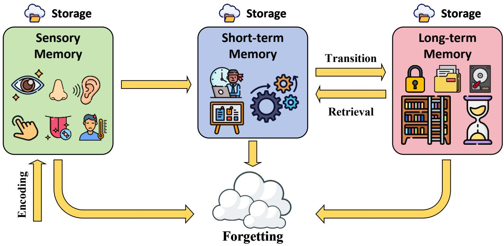
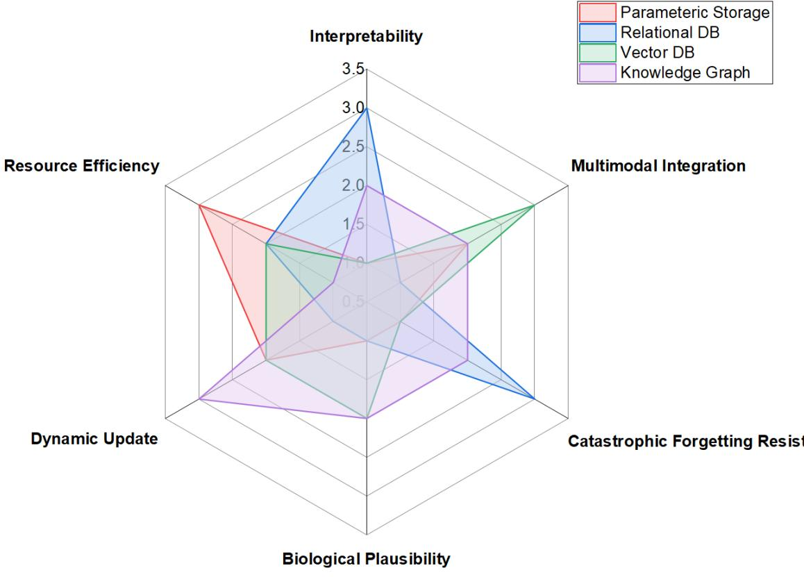
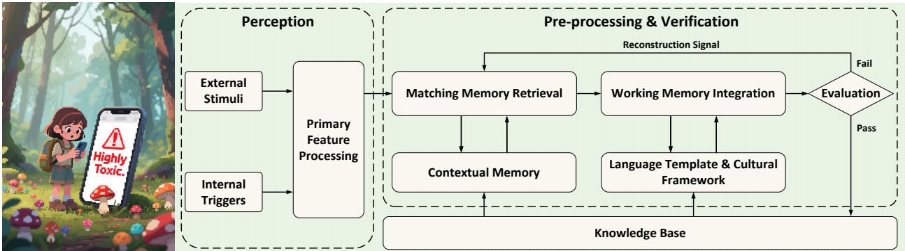
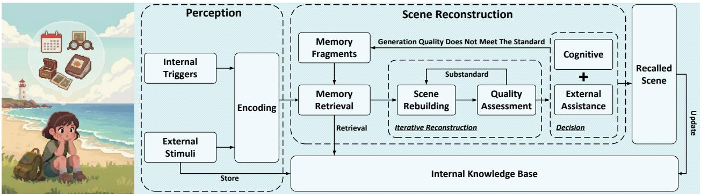
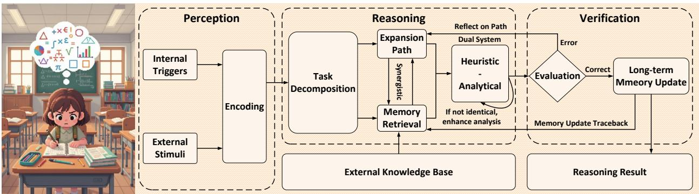
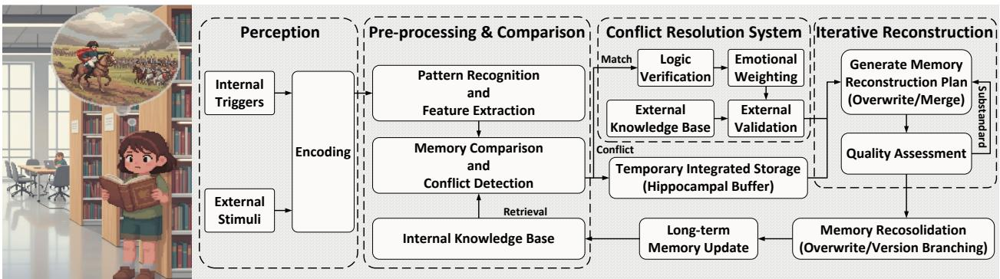
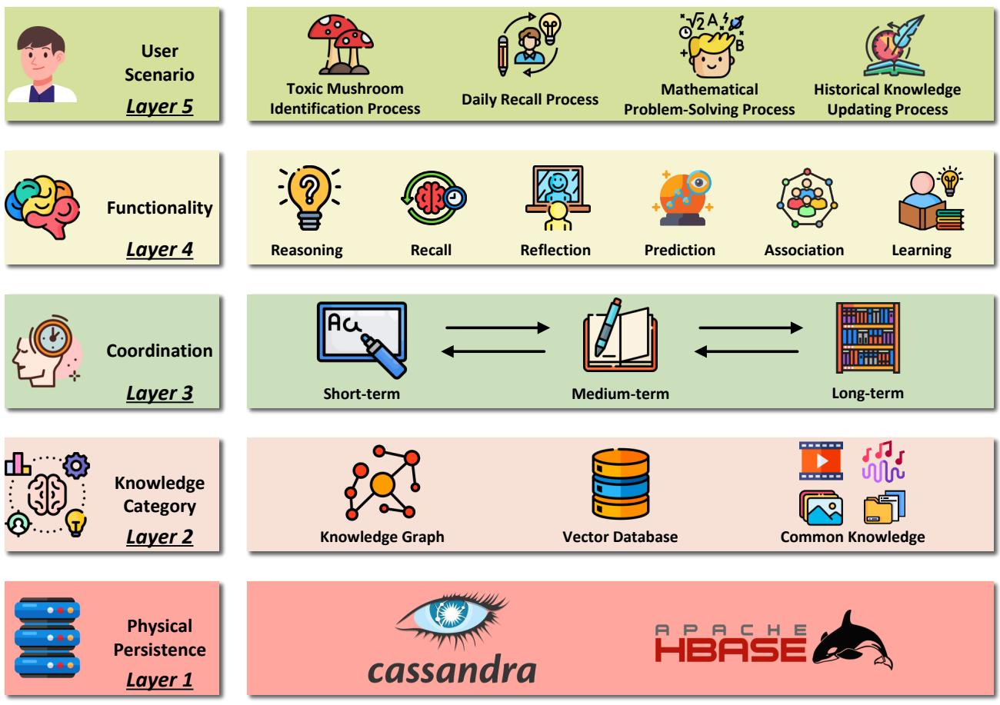
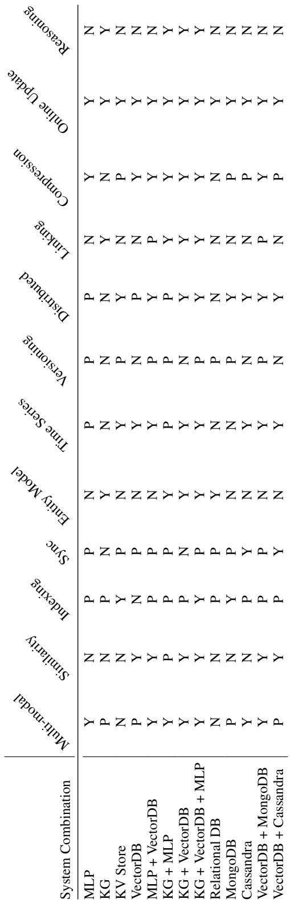

# A SCENARIO-DRIVEN COGNITIVE APPROACH TONEXT-GENERATION AI MEMORY

Linyue $\mathbf { C a i ^ { 1 , 3 , \dagger } }$ ,Yuyang Cheng2,3,t, Xiaoding Shao1, Huiming Wang1, Yong Zhao1,\*, Wei Zhang3\*, Kang $\mathbf { L i ^ { 3 , * } }$

1School of Computer Science, Sichuan University, Chengdu, China 2School of Cyber Science and Engineering,Sichuan University, Chengdu, China 3West China Biomedical Big Data Center, Sichuan University West China Hospital, Chengdu,China

{linyuecai811，yuyangc125,xiaodingshao,huimin.xxtz}@gmail.com yong.zhao@scupi.cn，{zhangwei，likang}@wchscu.cn

+These authors contributed equally to this work. \*Corresponding authors

# ABSTRACT

As artificial intelligence advances toward artificial general intelligence (AGI), the need for robust and human-like memory systems has become increasingly evident. Current memory architectures often suffer from limited adaptability, insufcient multimodal integration,and an inability to support continuous learning. To address these limitations, we propose a scenario-driven methodology that extracts essential functional requirements from representative cognitive scenarios, leading to a unified set of design principles for next-generation AI memory systems. Based on this approach, we introduce the COgnitive Layered Memory Architecture (COLMA),a novel framework that integrates cognitive scenarios, memory processes,and storage mechanisms into a cohesive design. COLMA provides a structured foundation for developing AI systems capable of lifelong learning and human-like reasoning, thereby contributing to the pragmatic development of AGI.

# 1 The Human Brain Memory System

The human brain's memory system consists of three levels: sensory memory,short-term memory,and long-term memory,each corresponding todiffrent brainregions[1,2,3].Sensorymemory is processedby the sensorycortex to handle transient information; short-termmemoryrelies ontheprefrontaland parietalcortices for temporary storage[4]; and long-term memory is consolidated and stored permanently by the hippocampus and neocortex[5,6][7,8,9].

  
Figure 1: Human Brain's Memory System

The human brain's memory system operates through the coordinated functioning of five key neural mechanisms to achieve effcient information processing,asshown inFigure1.Firstistheencoding stage,where external information is convertedintoeuralelectricalsgnalsbythesensorycortex[10,11,2]; nextisteosolidatioprocess,wrethe hippocampusconverts these signals into stable long-term memory[7,8,9,13]; followed by the storage phase, where diferent types of information are categorized and stored in specific brain regions;then comes the retrieval function, where the brain can quickly retrieve memories based on the neural connections established during storage[14,15]; Finaly,the forgeting mechanismintelligentlyfltersandremovesredundant information[16,7,17].Thissopisticated memory system not only enables long-term storage and rapid retrieval of information but also dynamically optimizes the allocation of cognitive resources[18].

In contrast,current AI memory systems remain at a rudimentary level of data storage,lacking systematic design and implementation of key cognitive functions such as collaborative processing and dynamic memory integration. As a result, they are unable to authentically replicate the complex operational mechanisms of human brain memory. This gap underscores the urgent need to draw deeper inspiration from the working principles of biological memory,in order to guide the design and evolution of next-generation memory architectures.

# 2Overall Limitations of Existing AI Memory

Current mainstream artificial intelligence systems primarily rely on four memory storage paradigms: parameterized storageinlangagemodels[19,20,21,22],elatioaldatabases,24,25],ectoratabases26,27,28],ndldge graphs based on triples[29,30]. While these architectures have enabled significant progressin AIcapabilities,they exhibit critical limitations whenassessed against the dynamic,adaptive,and integrative natureof human memory[31, 32,33,34].The six-dimensional evaluation inFigure 2 provides acomprehensive visual summaryof these limitations, revealing that no single existing approach excels acrossall criteria—underscoring the need for more holistic memory architectures.

Human cognition demonstrates an innate abilityto dynamically update,integrate,and prioritize information basedon relevance and experience[35,36,6]. Asclearlydepicted in Figure2,existing AI memorysystems struggle particularly in the dimensions of dynamic update capability and catastrophic forgeting resistance.Parameterized storage in language modelssufers fromcatastrophic forgetting[37,31,38,39],asevidencedbyitspoorperformanceonforgeting resistance in the evaluation,while structured databases require manual intervention for updates,showing limited dynamic update capacity that makes them ill-suited for scenarios requiring continuous learning. The human brain, by comparison,refines knowledge progressvely without erasure,balancing stability with plasticity—a capability current AI architectures lack[40,41, 42].

  
Figure 2:AI Memory Systems: Six-Dimension Evaluation

The dimension of multi-modal integration in Figure 2 further reveals a critical gap in memory integration. Human cognition effortlessy combines sensory inputs,emotional context， and abstract knowledge into a unified representation[43,36,44,45,46,47].For instance,recaling a familiar face involves not just visualdata but associatedemotions,conversations,and spatialcontext. However,as the evaluation shows,existing AI systems treat memory modules as isolated components-vector databases store perceptual data separately from symbolic knowledge graphs,preventing thekindof cross-modal reasoning that defines human intelligence[27j. This fragmentation limits applications in areas like social robotics or interactive AI, where real-world understanding depends on synthesizing diverse information streams.

The esource eficiencydimension intheevaluationhighlightsanotherkeydiferentiatorbetweenbiologicalandartificial memory. The brain dynamically strengthens or prunes memories based on importance and frequency, optimizing cognitive load[48].AIsystems,incontrast,as reflected in their medium to low scores onresource efciencyrelyon static storage strategies,retaiing irelevantdata while struggling toprioritize critical information[49].Thisiefficiency becomes apparent in real-time decision-making scenarios,such as autonomous navigation, where persistent safety rules must overide transient sensory noise—a balance current architectures cannot achieve without explicit programming.

Finaly, the interpretabilitydimension inFigure 2 exposes a fundamentalchallenge shared by most AI memory systems. Human memory supports introspection—we can often explain why we recallcertain details and how they relate to broader knowledge. AI memory representations, whether distributed embeddings or opaque model parameters,as visually confirmed bytheirlow interpretabilityscores,ack such transparency[5o,51].This limits their applicability in high-stakes domains like healthcare or law, where traceable reasoning is essential.

The comprehensive assessment provided by Figure 2 clearly indicates that incremental improvements to existing paradigms willnot sufice. Instead,future AImemory systems must draw inspration from neuroscience, incorporating mechanisms fordynamic consolidation,cross-modal association,and resource-aware storage[33].Theuniformly low scores i biological plausibility acrossallparadigms further reinforce this conclusion. By grounding design in human cognitive scenarios—from lifelong learning to explainable decision-making—we can move beyond rigid,isolated memory architectures toward systems that truly emulate the flexibility and richness of biological memory. In the following sections,we willexamine four real-world cognitive scenarios to concretely analyze the key limitations of current AI memory systems.

# 3Scenario Driven Cognitive Behavior

# S1: Toxic Mushroom Identification - A Cognitive Process Demonstration

Definition 1(Toxic Mushroom Identification Process).When you come across a mushroom in the wild,you first carefully examine itscolor and shape,then gently touch ittofeelits texture. Ifstilluncertain about its toxicity,you promptly take out your phone to photograph and identify it. Whenthe app displays a "highly toxic" warning, you quickly step back to avoid it while firmly committing its characteristics to memory.

  
Figure 3: Cognitive Process of Toxic Mushroom Identification

When identifying mushrooms,the brain works through association and prediction. Visual, tactile,and olfactory information are rapidly associated with stored mushroom characteristics in memory,enabling danger prediction and swift judgment[52j. The cognitive workflow depicted in Figure 3 illustrates this integrated processing mechanism.

Moderncognitive informatics providesa digital and coherent framework for explaining human cognitive processes [53]. Natural intellgence evolves by repeatedly applying simple navigation techniques in different coordinates millons of times[54].This phenomenon is asdescribedby theecological perception theory proposedby[55],where theimmediate characteristics of environmental stimuli directly form initial perceptual representations.This pre-conscious procesing provides a necessary buffer platform for subsequent semantic analysis.At this point, the perceptual information is stillin an unprocessed state,similar to the preparatory stage set by the nervous system for subsequent cognitive activities. During the stage of deep information procesing,the brain activates the hippocampus - medial temporal lobe memory circuit to extract the long-term stored semantic knowledge [56,57,58]. This process not only involves the routine retrieval offoreignlanguage vocabulary,but alsoincludes the topological activationof relatedcultural imagery - ranging from typical phonetic rhythm features to social interaction conversation frameworks [59,60,61].Hof et al.[62]confirmed through functional magnetic resonance imaging studies thatthe oscilations ofthe temporal cortex are significantlycorelated with the associative efficiencyof cros-cultural semantics,and this synchronized neural activity provides the necessry bioelectric basis for real-time language understanding [62]. The cognitive resource allocation dominated bytheprefrontal cortex constitutes the final ink ofthecognitiveIoop.This region maintain the focus of atention and information storage, thereby dynamically matching the immediate perceptual signals with the long-term cultural semantics [63]. As the joint experiment by Smith etal.[64]revealed, when the subjects needed to proces foreign accents and facial expresions simultaneously,te BOLD signal intensityof the dorsolateral prefrontal cortex showed acharacteristic fluctuation pattrn[64]. The efciency of integrating multi-dimensional information is essentiall derived from the temporal and spatial encoding mechanism of the working memory system for limited cognitive resources [65].

# S2: Daily Recall- A Dynamic Memory Reconstruction Process Demonstration

Definition 2 (Daily RecallProces). When trying to recall what you did on the 2nd of last month, your brain first determines what dayof the week it was -using this to retrieve regular weekly routines (e.g.,Monday meetings). If it was a weekend,you'drecallanyspecialplans.Ifstillunclearyou mightworkbackwardfromactivitiesonthelstorconsult external cues like photos in the phone and chat histories to trigger memories.

  
Figure 4: Dynamic Memory Reconstruction Process of Daily Recall

When recaling events from a specific date,the brain primarily employs two core memory functions: Recall and Association.The Recall mechanism retrieves routine activity memories through temporal frameworks,while the Association function dynamically integrates date information with external environmental cues to jointly accomplish memory reconstruction. This complex reconstruction process is visualized in Figure 4.

Typically,ittakes thirtyseconds toaminuteoffocusedreflection,uring whichthehippocampusandassociatedcortical areas collaborate[66,67, 68, 69]. External cues often support the otherwise vague mental imagery[70].

Initialy,the brain encodes exteroceptive inputs (e.g.sounds,smells,visuals)and interoceptivecues (e.g.,keywords, emotions into fragments of short-term memory held in working memory. These fragments activate long-term memory networks, retrieving relevant traces and integrating them into an initial multimodal scaffold[52, 71].

The brain then enters an iterative reconstruction phase,repeatedly assembling and refining these fragments[72,73]. Each cycle is evaluated for completeness,coherence,and affective congruence. Fragments that fallshort are revised and reprocessed in subsequentiterations. This resembles a computational feedback loop, gradually converging on a scene representation that approximates the original memory.

Despite such refinement, recallcan still distort reality—objects may be misremembered, or contextual features may shift due to imagination or interference.Eachactofrecallalso updates long-term memory,reinforcing accurate details or consolidating altered ones[74].

Understanding this dynamic reconstruction mechanism shown in Figure 4 provides key insights for designing memory systems inartificial intellgence[75,76]—highlighting therolesofmultimodalfusion,terativefedback,andsyaptic plasticity33,77,78,79]. Italso informs neuroscience-based approaches to treating memory disorders and developing cognitive enhancement technologies[80].

# S3: Mathematical Problem-Solving - A Reasoning Process Demonstration

Definition 3 (Mathematical Problem-Solving Process). When presented with a problem, you quickly identify the questiontype and objectives,analyzethe givenconditions todetermine the solution approach,simultaneously generate multiple solution pathways in your mind while retrieving relevantformulas,verify their validity before proceeding with the optimal derivation,record the final answer, and ultimately review theentire processto consolidate insights and refine your problem-solving strategies.

  
Figure 5: Reasoning Process of Mathematical Problem-Solving

The mathematical reasoning process relies on Reasoning for and Reflection. When solving problems,the Reasoning function enables systematic manipulation of mathematical concepts through rule-based operations,while Reflection facilitates critical evaluation of both successful and unsuccessful solution strategies,leading to improved future performance. The complete reasoning cycle is systematically depicted in Figure 5.

Inacomplete reasoning cycle,individuals begin by perceiving and encoding either external stimuli orinternally initiated task-related information.This information is temporarily maintained within working memory,primarilysupported by the dorsolateralprefrontalcortex (DLPFC),andissubsequentlydecomposedintosubgoals forfurther procesing[81,82]. Next,the parietal-frontal network—working inconjunction with the medial temporal lobe—facilitates therapid retrieval of relevant long-term memories[83].This network alsounderpins the expansion of asociative links andthe integration of relational information through divergent activation along hypothesized “reasoning chain"[84,85]. We would suggest that this part of the process could be complemented bythe use of an external knowledge base.The retrieved episodic or semantic memory elements function as“knowledge cues”that are concurrently processed bya dual-system architecture. Specifically,the temporal-frontal association system generates intuitive heuristics,whereas thefrontal-parietal executive network engages inrule-based,deductive or inductive inference[86,87].These two systems operate in parallel and their outputs are subject to conflict monitoring by the anterior cingulate cortex (ACC);if an inconsistency between the intuition and the rule is detected,the ACCcals back to the frontal lobe to enhance depth analysis[88,89].The preliminary outcome is subsequently routed to an evaluation module.If the output is assessed as corrct,consolidation mechanisms are triggered,promoting the encoding ofnewrules intolong-termmemory[9]. Conversely,ifthe evaluation considers the outcome unsatisfactory,the process is recursively directed back to theretrieval stage.There,adjustments to the knowledge structure and problem-solving strategy are made.This iterative loop—comprising stages of perception, decomposition,retrieval,reasoning,verification,andreinforcement—ultimatelyyieldsvalidatedreasoning outcomes and forms structured cognitive traces that support future recall and generalization.

# S4: Historical Knowledge Updating - A Memory Updating Process Demonstration

  
Figure 6: Memory Updating Process of Historical Knowledge Updating

The memory system employs both recalland continual learning when processing new historical information. Recall retrieves prior knowledge while continual learning integrates new facts,enabling adaptive understanding of historical events. This sophisticated updating mechanism is detailed in Figure 6.

When you are reading anew book about history,a historical event mentioned inthe book may be something you already know about.Thenew information enters the sensory cortex of the brain for encoding,while the memory you previously stored abouthis event is activated. At this point,the asociation cortex region of the brain compares and integrates the details mentioned in the new book with your existing memory. If the new informationconflicts withthe old memory, the brain acts like an advanced scanner to reassess and update the memory.

First,external stimuli andinternal triggers are encoded through thesensorycortex, with preliminarypatternrecognition and feature extraction occurring in the association cortex regions of the temporal and parietal lobes[90,91,92j.This processis akin to an advanced scanner breaking down and categorizing information. Next, the information enters the memory preprocessing and comparison phase.The hippocampus,as the central relay station,retrieves relevant existing knowledge from the long-term memorystorage area for enhancement and comparison[93,94,95,96,97]. This process differs fundamentally from simple key-value retrieval,resembling more closely a knowledge-graph-style exploration that expands outward from core nodes along semantic asociative networks[98,99]. If the new information highly matches existing memories,the prefrontalcortex activates the default mode network,temporarily integrating and storing it inthe hippocampusbuffer[10o,01,102,03].Ifconflictsare detected,thebrainiitiatesadeepqualitycheck:the prefrontal cortex performs logical verification,the amygdala assigns emotional weight toadjust priorities,and external databases areconsulted forcross-validation[88,104,io5].Subsequently,the information enters the core validation loop.The system generates multiple reconstruction schemes and conducts multiple rounds of quality asessments based on consistency and completeness Memories thatfail to meet te standardsare returned for reprocessing until tey pass the qualitycheck.Finall,memories that meet the criteria enterlong-term storage through a reconsolidation mechanism: either by being integrated into the existing memory network through long-term potentiation (LTP) mechanisms[41],or by forming new independent memory traces[106].

This process reveals the dynamic nature of memory updating—it is not a passive storage process but an active reconstruction processinvolving colaboration among multiple brain systems,ensuring the validityand adaptability of information. Based on observations of human memory updating and related research, we define memory updating as the process by whichan intelligent agent performs memory retrieval,comparison,verifcation,andreconsolidation,and have summarized the memory updating mechanism as shown in Figure 6.

# 4A Scenario-Driven Cognitive Capability Framework for AI Memory Systems

Traditional memory mechanisms are often reduced to "data warehouses" for basic storage and retrieval.This paradigm requires scenario-driven re-evaluation: deducing essentialcapabilities fromtarget operationalscenarios.Next-generation memory must become core infrastructure for AGI cognition,reasoning,and autonomous evolution,possessng five critical capabilities:

1. Reasoning: Logical/causal inference from memory.   
2.Recall: Precise, efficient information retrieval.   
3. Association: Cross-domain/cross-modal knowledge linking.

  
Figure 7: Framework of COgnitive Layered Memory Architecture

4. Prediction: Anticipating future states based on patterns.

5. Reflection: Self-evaluation and correction.

6. Continual Learning: Integrating new knowledge while preserving stability.

In evaluation frameworks,conventional accuracy-centric metrics fail to capture memory systems’real-world utility Addressing AGI's requirements necesitates transcending traditional paradigms through a contextualized framework that assesses operational eficacy via multidimensional dimensions: cognitivecapacity,adaptive agilityand evolutionary scalability.

To address this, we construct a comparative framework encompassing twelve multifaceted dimensions—including multimodal support,similarity retrieval,and indexing mechanisms—systematicalycharacterizing criticalcapabilities of mainstream memory storage technologies and hybrid architectures.This framework establishes acomprehensive, future-oriented evaluation paradigm by visualizing capability coverage acrossexisting solutions,offering actionable insights for next-generation memory system design and optimization.The results are shown in Table 1.

# 5Cognition Layered Memory Architecture

As discussed above,current artificial intelligence memory systems exhibit significant deficiencies in dynamic adaptability,multimodal integration,resource efciencyandinterpretabilityrenderingtheminadequate forsupportingcomplex cognitive tasks in real-world scenarios.First, static storage architectures fail to accommodate dynamic cognitive demands: parametric storage suffers from catastrophic forgeting,while traditional databases rely heavily on manual updates.Second, multimodal information is often stored inisolation,resulting inalack of cross-modal association and integration capabilities.Third,resource allocation mechanisms are rigid,unable to dynamically reinforcecritical information ordiscard redundant memories in a manner akin to the human brain.Finaly,memory representations lack interpretability: although embedding vectors supportretrieval,theyoffer limited traceabilityof the reasoning process. These shortcomings are particularly pronounced in scenarios involving continual learning, complex reasoning,and real-time decision-making,severely constraining the development of AI cognitive abilities.

Analysis of scenarios such as mushroom recognition, everyday memory recall mathematical problem solving,and historical knowledge updating reveals that the core advantages of human memory lie in its hierarchical coordination mechanisms (e.g,dynamic interactions between sensory and long-term memory),cross-modal associationcapabilities (e.g., seamlessintegration of visual and semantic information),and stabilityand adaptability in continual learning. Furthermore,through a comparative analysis of twelve storage architectures (Table1),we find that Cassandra-based architectures exhibit distinct advantages in distributed scalability,multimodal support,online updating,and temporal control. Its fexible columnar storage structureand high-throughput writecapability provide asolid physical foundation for constructing hierarchical memory systems.

Based on the above insights, we propose a novel hierarchical artificial intellgence memory architecture—COgnitive Layered Memory Architecture (COLMA)—which flexibly leverages either Cassndra[107]or HBase[108] (functionally similar altermatives)as its underlying distributed storage layer. COLMA is designed to realize the next-generation AI memory system,endowed with dynamic adaptability,cros-modal integration capabilities,andcontinuous evolvability. Its hierarchical structure is illustrated in Figure 7.

The COLMA is organized into five levels,arranged from bottm to top as the Physical Persistence Layer, Knowledge Category Layer, Coordination Layer, Functionality Layer, and User Scenario Layer. COLMA employs a hierarchical design paradigm,organically integrating cognitive scenarios,memory functionalities,and underlying storage to construct a dynamically coordinated and unified system.

At the User Scenario Layer, the system flexibly supports a wide range of cognitive and reasoning tasks,achieving a deep coupling between application requirements and memory operations. The Functionality Layer integrates core AI capabilities such as reasoning,recall,and association,endowing the system with human-likecomplex knowledge procesing abilities.At the Coordination Layer,dynamiccolaboration among long-,medium-,andshort-term memories simulates the interaction between the hippocampus and neocortex in biological memory,enabling eficient information integration and optimized alocation.The Knowledge Category Layer fuses knowledge graphs,vector databases,and common knowledge to construct multimodal knowledge representations,while leveraging Cassandra’s distributed features for eficient management and retrieval. Atthe bottom, the Physical Persistence Layer relies on Cassandra's high-performance storage capabilities to ensure reliable data persistence and rapid access.

Overall,COLMA is notlimited toaspecifc technical implementationbutserves asa theoretical framework fornextgeneration AI memory systems.Its core concept lies in combining Cassndra's elastic scalabilityand high-performance storage mechanisms with heuristic principles inspired by cognitive science, tereby constructing an intellgent memory system endowed with adaptability, evolvability,and scenario-aware capabilities.

To quantitatively assessthe advantages of our proposed COLMA framework, we conducted a systematic evaluation against six prominent memory architectures for AIsystems: A-Mem[109],MemO[110],MemOg[110],MEM1[111], MIRIX [112], and $\scriptstyle \mathbf { M e m } ^ { p }$ [113]. The evaluation focused on ten critical dimensions essential for next-generation AI memory systems:

1. Dynamic Update: Ability to adaptively modify stored knowledge.   
2. Indexing: Efficiency in organizing and retrieving information.   
3.Multimodal Integration: Support for diverse data types and modalities.   
4. Heterogeneous Representation: Ability to unify diverse data types and formats.   
5. Interpretability: Transparency and explainability of memory operations.   
6. Biological Plausibility: Alignment with human memory mechanisms.   
7. Distributed Scalability: Performance in distributed computing environments.   
8. Time Series Handling: Effectiveness in processing temporal sequences.   
9.Associative Reasoning: Capacity for connection-based inference.   
10. User Permisson: Granular access control and data isolation based on user roles or identities to ensure security,   
privacy, and collaborative integrity.

Each dimension was rated on a three-star scale ( ${ \bf \dot { \star } } = { \bf B } { \bf a s i c }$ $\star \star = \mathrm { G o o d }$ ， $\star \star \star =$ Excellent) based on comprehensive analysis of each architecture's capabilitiesand limitations.The results,presented in Table 2,demonstrate COLMA's superior performance across all evaluated dimensions.

Table 2: Comparative Evaluation of Memory Architectures   

<table><tr><td>Evaluation Dimension</td><td>COLMA (Ours)</td><td>A-Mem</td><td>MemO</td><td>MemOg</td><td>MEM1</td><td>MIRIX</td><td>Memp</td></tr><tr><td>Dynamic Update</td><td>★★*</td><td>★★*</td><td>★★*</td><td>★★*</td><td>*★*</td><td>★**</td><td>★★★</td></tr><tr><td>Indexing</td><td>★**</td><td>★★*</td><td>★**</td><td>***</td><td></td><td>★★*</td><td></td></tr><tr><td>Multimodal Integration</td><td>★★★</td><td>★</td><td>★</td><td>★</td><td>★</td><td></td><td>★</td></tr><tr><td>Heterogeneous Representation</td><td>★★★</td><td>★</td><td>★</td><td>★</td><td>★</td><td>★*★</td><td>★</td></tr><tr><td>Interpretability</td><td>★*</td><td></td><td></td><td>***</td><td>★</td><td></td><td></td></tr><tr><td>Biological Plausibility</td><td>★**</td><td>★*</td><td>**</td><td></td><td>★</td><td>★</td><td>★</td></tr><tr><td>Distributed Scalability</td><td>★★★</td><td>★*</td><td></td><td>X</td><td>★</td><td>★**</td><td>★</td></tr><tr><td>Time Series Handling</td><td>★★★</td><td></td><td></td><td></td><td></td><td>★*★</td><td></td></tr><tr><td>Associative Reasoning</td><td>★**</td><td>***</td><td>★</td><td>***</td><td></td><td></td><td></td></tr><tr><td>User Permission</td><td>★★*</td><td>★</td><td>★</td><td>★</td><td>★</td><td></td><td>★</td></tr><tr><td>Overall Score</td><td>30/30</td><td>21/30</td><td>19/30</td><td>21/30</td><td>15/30</td><td>24/30</td><td>17/30</td></tr></table>

Rating Scale: $\star =$ Basic, $\star { \star } = \mathrm { G o o d }$ $\star \star \star =$ Excellent. Scoring: Each $\star = 1$ point, maximum 3 points per dimension.

The evaluation reveals several key insights. First, COLMA achieves perfect scores across alldimensions-including heterogeneous representation and user permission partitioning—demonstrating its comprehensive capabilities as a unified memory architecture.This exceptional performance stems from its layered design that integrates Cassandra's distributed storage,multimodal knowledge representation,cognitive-inspiredcoordination mechanisms,andaflexible encoding framework to unifydiverse data types (text,structured tables,multimodal fragments)while preserving their intrinsic properties.Second, while several systems (A-Mem, MemO, MemOg) excel indynamic updating and indexing capabilities,theyuniformlystrugle with multimodal integrationand heterogeneous representation—critical limitations that COLMA overcomes through its knowledge category layer: this layer not only seamlessly combines knowledge graphs,vector databases,and common knowledge bases butalso enablescoherent association of disparatedata formats, avoiding the siloing of heterogeneous information seen incomparative systems.Third,COLMA stands out in biological plausibility,scoring signifcantly higherthan allcomparative systems.This advantage reflects its design inspiration from human memory mechanisms,including hippocampal-neocortical interactions,dynamic memory consolidation processes observed in biological systems,and the human brain’s innate ability to integrate varied types of experiences into unified memory representations—paralleling COLMA's strength in heterogeneous data unification.

The comparative analysis confirms that COLMA represents a significant advancement over existing memory architectures,ofering a more holistic solution that addresses the multifaceted requirements of next-generation AIsystems. Crucialy,inresponse tothe evolutionof artificial intelligence towardcollaborative intellgence, COLMA introduces a novel memory paradigm for Multi-Agent Systems (MAS)[114,115,116,117,118],overcoming the isolation and staticityinerentintraditionalmemorymodules.ts hierarchical,interpretable,ndadaptivearchitectureenablesuiied andtraceable knowledge sharing across agents,driving a fundamental shift from behavioral coordination to cognitive collaboration—ultimately enabling the emergence of collective inteligence.

# 6Conclusion

This paper identifies critical limitations of current AI memory systems—in adaptability,multimodal integration, resource eficiency,and interpretability—and draws inspiration from human cognitive scenarios to extract principles of coordination and continual learning. Building on these insights, we introduce the COgnition Layered Memory Architecture (COLMA), which integrates Cassandra's scalable persistence with heuristic principles from cognitive science. COLMA ofers aunifed,scenario-driven framework that repositions memory notas static storage,but as an adaptive,multimodal,and evolvable substrateforitellgence.Lookingahead,COLMA willbe deployed and validated inreal-worlddomains such as healthcare,finance,and scientific research,where its practicalutility willbecontiuously demonstrated—and through which we williteratively explore and deepen our understanding of AI cognition in context. In summary,COLMA provides a scalable and cognitively inspired foundation for next-generation AIcognition,and we envision it as a cornerstone toward the realization of artifcial general intelligence.

# Acknowledgements

This study was supported by the Interdisciplinary Crossing and Integration of Medicine and Engineering for Talent Training Fund, West China Hospital,Sichuan University;the1-3·5 project fordisciplines of excelence, West China Hospital, Sichuan University(ZYYC2104);the National Natural ScienceFoundation of China (NSFC)under Grant [No.62177007].

# References

[1] Richard C Atkinson and Richard M Shifrin. Human memory: A proposed system and its control processes. In Unknown Editor, editor, Psychology of learning and motivation,volume 2, pages 89-195.Elsevier,1968.   
[2] Endel Tulving and Daniel L Schacter. Priming and human memory systems.Science,247(4940):301-306,1990.   
[3]Larry R Squire. Memory and brain systems: 1969-2009.Journal of Neuroscience,29(41):12711-12716,2009.   
[4] George Sperling. The information available in brief visual presentations. Psychological monographs: General and applied,74(11):1, 1960.   
[5] Patricia S Goldman-Rakic. Cellular basis of working memory. Neuron,14(3):477-485,1995.   
[6] Alan Baddeley. The episodic buffer: a new component of working memory? Trends in cognitive sciences, 4(11):417-423, 2000.   
[7] William Beecher Scovill and Brenda Milner.Loss ofrecent memory after bilateral hippocampal lesions.Journal of neurology, neurosurgery, and psychiatry,2O(1):11, 1957.   
[8] James L McClelland, Bruce L McNaughton, and Randall C O'Reilly. Why there are complementary learning systems in the hippocampus and neocortex: insights from the successes and failures of connectionist models of learning and memory. Psychological review,102(3):419,1995.   
[9] Yadin Dudai.The neurobiology ofconsolidations,or,how stable is the engram? Annu. Rev. Psychol.,55(1):51-86, 2004.   
[10]Nikos K Logothetis,Jon Pauls,Mark Augath, Torsten Trinath,and Axel Oeltermann.Neurophysiological investigation of the basis of the fmri signal. nature,412(6843):150-157,2001.   
[11] Eric R Kandel, Yadin Dudai,and Mark R Mayford. The molecular and systems biology of memory. Cell, 157(1):163-186,2014.   
[12] Jesse Rissman, Adam Gazzaley,and Mark D'Esposito. Measuring functional connectivity during distinct stages of a cognitive task. Neuroimage,23(2):752-763, 2004.   
[13] Paul W Frankland and Bruno Bontempi. The organization of recent and remote memories.Nature reviews neuroscience,6(2):119-130,2005.   
[14] Roger Ratcliff. A theory of memory retrieval. Psychological review, 85(2):59,1978.   
[15] Mark E Bouton.Context, time,and memory retrieval in the interference paradigms of pavlovian learning. Psychological bulletin, 114(1):80,1993.   
[16] Benton J Underwood. Interference and forgeting. Psychological review, 64(1):49,1957.   
[17] Paul Ricoeur. Memory, history, forgetting. University of Chicago Press,2004.   
[18] John TWixted.The psychology and neuroscience of forgeting. Annu. Rev. Psychol.,5(1):235-269,2004.   
[19] Yoshua Bengio, Aaron Courvile, and Pascal Vincent. Representation learning: A review and new perspectives. IEEE transactions on pattern analysis and machine intelligence,35(8):1798-1828,2013.   
[20] Ian J. Goodfellow,Dumitru Erhan, Pierre Luc Carrier,Aaron Courville,Mehdi Mirza,Ben Hamner,_Will Cukierski, Yichuan Tang, David Thaler, Dong-Hyun Lee, Yingbo Zhou, Chetan Ramaiah, Fangxiang Feng, Ruifan Li, XiaojieWang,Dimitris Athanasakis,John Shawe-Taylor,Maxim Milakov,John Park,Radu Ionescu, Marius Popescu, Cristian Grozea, James Bergstra, Jingjing Xie, Lukasz Romaszko, Bing Xu, Zhang Chuang, and Yoshua Bengio. Challenges in representation learning: A report on three machine learning contests. In Minho Lee,Akira Hirose,Zeng-Guang Hou,and Rhee Man Kil, editors, Neural Information Processing, pages 117-124,Berlin,Heidelberg,2013.Springer Berlin Heidelberg.   
[21] Wayne Xin Zhao, Kun Zhou, Junyi Li,Tianyi Tang, Xiaolei Wang, Yupeng Hou, Yingqian Min,Beichen Zhang, Junjie Zhang, Zican Dong, et al. A survey of large language models. arXiv preprint arXiv:2303.18223,1(2), 2023.   
[22] Yunfan Gao, Yun Xiong, Xinyu Gao, Kangxiang Jia,Jinliu Pan, Yuxi Bi, YixinDai,Jiawei Sun, Haofen Wang, and Haofen Wang. Retrieval-augmented generation for large language models: A survey. arXiv preprint arXiv:2312.10997,2(1),2023.   
[23] David Maier. The theory of relational databases, volume 11. Computer science press Rockville,1983.   
[24] Terry Halpin and Tony Morgan. Information modeling and relational databases. Morgan Kaufmann, 2010.   
[25]Peter W Battaglia, Jessica B Hamrick, Victor Bapst,Alvaro Sanchez-Gonzalez, Vinicius Zambaldi, Mateusz Malinowski, Andrea Taccheti, David Raposo,Adam Santoro,Ryan Faulkner, et al. Relational inductive biases, deep learning, and graph networks. arXiv preprint arXiv:1806.01261, 2018.   
[26] Sainbayar Sukhbatar, Jason Weston, RobFergus, et al. End-to-end memory networks. Advances in neural information processing systems, 28, 2015.   
[27]Tadas Baltrusaitis, Chaitanya Ahuja,and Louis-Philippe Morency. Multimodal machine learning: A surveyand taxonomy. IEEE transactions on pattern analysis and machine inteligence, 41(2):423-443,2018.   
[28] Jeff Johnson,Mattijs Douze,and Hervé Jegou. Bilion-scale similaritysearch with gpus. IEEE Transactions on Big Data,7(3):535-547,2019.   
[29] Michael Schlichtkrull, Thomas N. Kipf, Peter Bloem, Rianne vanden Berg, Ivan Titov,and Max Welling. Modeling relational data with graph convolutional networks. In Aldo Gangemi, Roberto Navigli, Maria-Esther Vidal, Pascal Hitzler,Raphael Troncy,Laura Hollink, Anna Tordai,and Mehwish Alam, editors,The Semantic Web, pages 593-607, Cham,2018.Springer International Publishing.   
[30] Aidan Hogan,EvaBlomqvist,Michael Cochez,Claudiad'Amato,Gerard De Melo,Claudio Gutierrez,Sabrina Kirrane,Jose Emilio Labra Gayo,Roberto Navigli, Sebastian Neumaier, et al. Knowledge graphs. ACM Computing Surveys (Csur), 54(4):1-37, 2021.   
[31] Anthony Robins.Catastrophic forgeting,rehearsal and pseudorehearsal. Connection Science,7(2):123-146, 1995.   
[32] Daniel L Schacter, Donna Rose Addis,and Randy L Buckner. Remembering the past to imagine the future: the prospective brain. Nature reviews neuroscience, 8(9):657-661, 2007.   
[33]Demis Hassabis,Dharshan Kumaran, Christopher Summerfield,and Matthew Botvinick.Neuroscience-nspired artificial intelligence. Neuron, 95(2):245-258, 2017.   
[34] Endel Tulving et al. Episodic and semantic memory. Organization of memory,1(381-403):1,1972.   
[35] Esther Thelen and Linda B Smith. A dynamic systems approach to the development ofcognition and action. MIT press,1994.   
[36] Allen Newell. Unified theories of cognition. Harvard University Press,1994.   
[37]Michael McCloskey and Neal JCohen. Catastrophic interference in connectionist networks: The sequential learning problem. In Unknown Editor, editor, Psychology of learning and motivation, volume 24,pages 109-165. Elsevier,1989.   
[38] James Kirkpatrick,RazvanPascanu,NeilRabinowitz,JoelVenes,Guillaume Desjardins,Andrei ARusu,Kieran Milan, John Quan,Tiago Ramalho, Agnieszka Grabska-Barwinska, et al. Overcoming catastrophic forgeting in neural networks. Proceedings of the national academy of sciences,114(13):3521-3526,2017.   
[39] Joan Serra, Didac Suris,Marius Miron,and Alexandros Karatzoglou. Overcoming catastrophic forgettig with hard attntion to the task. In Jennifer Dyand Andreas Krause,editors,Proceedings of the 35th International Conference on Machine Learning, volume 80 of Proceedings of Machine Learning Research, pages 4548-4557. PMLR,10-15 Jul 2018.   
[40] Donald Olding Hebb. The organization of behavior: A neuropsychological theory. Psychology press,2005.   
[41]Tim VP Blissand Terje Lomo. Long-lasting potentiation of synaptic transmisson in the dentate area of the anaesthetized rabbit folowing stimulation of the perforant path. The Journal of physiology, 232(2):331-356, 1973.   
[42] Eric R Kandel. The molecular biology of memory storage: a dialogue between genes and synapses. Science, 294(5544):1030-1038,2001.   
[43]Antonio R Damasio.The brain binds entities and events by multiregional activation from convergence Zones. Neural computation,1(1):123-132,1989.   
[44] Antonio R Damasio.The feeling of what happens: Body and emotionin the making ofconsciousnes. Houghton Mifflin Harcourt, 1999.   
[45] Ladan Shams and Aaron R Seitz. Benefts of multisensory learning. Trends incognitive sciences,12(11):411-417, 2008.   
[46]Randy L Buckner and Daniel C Carroll Self-projection and the brain.Trends in cognitive sciences,11(2):49-57, 2007.   
[47] Jeffrey R Binder and Rutvik HDesai. The neurobiology of semantic memory. Trends in cognitive sciences, 15(11):527-536, 2011.   
[48] Giulio Tononi and Chiara Cireli. Sleep and the price of plasticity: from synaptic and celular homeostasis to memory consolidation and integration. Neuron, 81(1):12-34, 2014.   
[49] David Rolnick, Arun Ahuja, Jonathan Schwarz, Timothy Lilicrap,and Gregory Wayne. Experience replay for continual learning. Advances in neural information processing systems, 32, 2019.   
[50]Finale Doshi-Velez and Been Kim. Towards a rigorous science of interpretable machine learning.arXiv preprint arXiv:1702.08608,2017.   
[51] Wojciech Samek, Gregoire Montavon, Sebastian Lapuschkin, Christopher JAnders,and Klaus-Robert Muller. Explaining deep neural networks and beyond: A review of methods and applications. Proceedings of the IEEE, 109(3):247-278,2021.   
[52] Lawrence W Barsalou. Perceptual symbol systems. Behavioral and brain sciences,22(4):577-660,1999.   
[53] There was a problem providing the content you requested. https://ww.sciencedirect .com/science/ article/abs/pii/S1389041708000417,2024. Accessed: 2024-08-11.   
[54] Xin Li. On organizational principles of neural systems. https://arxiv.org/html/2402.14186v1, 2024. arXiv preprint arXiv:2402.14186.   
[55] James JGibson. The Senses Considered as Perceptual Systems. Houghton Mifflin, 1966.   
[56] Lary R Squire. Memory systems of the brain: a brief history and current perspective. Neurobiology of learning and mem0ry,82(3):171-177,2004.   
[57]Elizabeth A Phelps. Human emotion and memory: interactions of the amygdala and hippocampal complex. Current opinion in neurobiology,14(2):198-202, 2004.   
[58] K. Tanaka et al. Key-value memory in the brain. arXiv preprint arXiv:2501.02950,2025.   
[59]Larry R Squire. Memory systems of the brain: abrief history and current perspective. Neuroscience,129(1):63- 71, 2004.   
[60] Peter Hagoort. On broca,brain,and binding: a new framework. Trends in cognitive sciences,9(9):416-423, 2005.   
[61]Kara DFedermeier. Thinking ahead: The role and roots of prediction in language comprehension.Psychophysiology, 44(4):491-505, 2007.   
[62] Patrick R Hof et al.The role of the medial temporal lobe in memoryand perception. Learning & Memory, 10(4):490-498, 2003.   
[63] Edmund T. Rols. Memory, Atention,and Decision-Making: A Unifying Computational Neuroscience Approach. Oxford University Press, Oxford,2008.   
[64] Earl E Smith and John Jonides. The role of prefrontal cortex in working memory. Cognitive, Affective， & Behavioral Neuroscience,6(1):13-17,2006.   
[65] Alan D Baddeley. Working memory. Science, 255(5044):556-559,1992.   
[6] Howard Eichenbaum. Memory: organization and control. Annual review ofpsychology, 68(1):19-45,2017.   
[67] Dasom Kwon, Jungwoo Kim,Seng Bum Michael Yoo,and Won Mok Shim. Coordinated representations for naturalistic memory encoding and retrieval in hippocampal neural subspaces. Nature Communications,16(1):641, 2025.   
[68] Liisa Raud,Markus HSneve, Didac Vidal-Pineiro,Oystein Sorensen,Line Folvik, Hedda TNess, Athanasia M Mowinckel, Hakon Grydeland, Kristine B Walhovd,and Anders M FjellHippocampal-cortical functional connectivity during memory encoding and retrieval. NeuroImage, 279:120309, 2023.   
[69]Melissa C Duff,Natalie V Covington, Caitlin Hilverman,and Neal JCohen.Semantic memory and the hippocampus: Revisiting, reafirming,and extending the reach of their critical relationship. Frontiers in human neuroscience,13:471,2020.   
[70] Endel Tulving and Donald M Thomson. Encoding specificity and retrieval proceses in episodic memory. Psychological review, 80(5):352, 1973.   
[71] Charan Ranganath. Binding items and contexts: The cognitive neuroscience of episodic memory. Current directions in psychological science, 19(3):131-137, 2010.   
[72] Yuanbing Shi,Lan Yang, Jiayu Lu, Ting Yan, Yongkang Ding,and Bin Wang. The dynamic reconfiguration of the functional network during episodic memory task predicts the memory performance. Scientific Reports, 14(1):20527, 2024.   
[73] Donna Rose Addis. Are episodic memories special? on the sameness of remembered and imagined event simulation. Journal of the Royal Society of New Zealand, 48(2-3):64-88,2018.   
[74] Cristina M Alberini and Joseph ELeDoux. Memory reconsolidation. Curent Biology,23(17):R746-R750, 2013.   
[75]Dong Kyum Kim,Jea Kwon,Meeyoung Cha,and ChulLee. Transformeras a hippocampal memory consolidation model based onnmdar-inspired nonlinearity. Advances in Neural Information Processing Systems,36:14637- 14664, 2023.   
[76] James CR Whitington,Joseph Warren,and Timothy EJBehrens. Relating transformers to models and neural representations of the hippocampal formation. arXiv preprint arXiv:2112.04035,2021.   
[77] Eleanor Spens and Neil Burgess. A generative model of memory construction and consolidation. Nature human behaviour, 8(3):526-543,2024.   
[78] Zhenglong Zhou, Geshi Yeung,and Anna C Schapiro. Self-recovery of memory via generative replay. arXiv preprint arXiv:2301.06030,2023.   
[79] Ronald Kemker and Christopher Kanan. Fearnet: Brain-inspired modelfor incremental learning. arXiv preprint arXiv:1711.10563,2017.   
[80] Yiming Du, Wenyu Huang, Danna Zheng, Zhaowei Wang, Sebastien Montella, Mirela Lapata, Kam-Fai Wong, and Jeff Z Pan. Rethinking memory in ai: Taxonomy, operations,topics,and future directions. arXiv preprint arXiv:2505.00675,2025.   
[81] Alan Baddeley. Working memory: Theories,models,and controversies. Annual review ofpsychology,63(1):1-29, 2012.   
[82]EK Miller and JD Cohen. An integrative theory of prefrontal cortex function. Annu. Rev. Neurosci.,24(1):167- 202,2001.   
[83] R Cabeza and L Nyberg. Imaging cognition I: An empirical review of 275 PET and fMRI studies. J. Cogn. Neurosci.,12(1):1-47, January 2000.   
[84] Kalina Christof,Vivek Prabhakaran, Jennifer Dorfman, Zuo Zhao,James K Kroger,Keith JHolyoak,and John DE Gabrieli.Rostrolateral prefrontal cortex involvement in relational integration during reasoning. Neuroimage,14(5):1136-1149, 2001.   
[85]Rex EJung and Richard JHaier.The Parieto-Frontal integration theory(P-FIT)of inteligence: converging neuroimaging evidence. Behav. Brain Sci., 30(2):135-54; discussion 154-87, April 2007.   
[86] Jerome Prado,Angad Chadha,and James R Booth. The brain network for deductive reasoning: aquantitative meta-analysis of 28 neuroimaging studies. Journal of cognitive neuroscience, 23(11):3483-3497, 2011.   
[87] Vinod Goel and Raymond JDolan.Diferential involvement of left prefrontal cortex in inductive and deductive reasoning. Cognition, 93(3):B109-21, October 2004.   
[88]Mathew M Botvinick, Todd S Braver,Deanna M Barch,Cameron S Carter,and Jonathan DCohen. Conflict monitoring and cognitive control. Psychological review,108(3):624, 2001.   
[89] John G Kerns, Jonathan D Cohen, Angus W MacDonald,3rd,Raymond Y Cho, V Andrew Stenger,and Cameron S Carter. Anterior cingulate conflict monitoring and adjustments in control. Science,303(5660):1023- 1026,February 2004.   
[90] Larry R Squire and Stuart Zola-Morgan.The medial temporal lobe memory system. Science, 253(5026):1380- 1386,1991.   
[91]David HHubel and Torsten N Wiesel. Receptive fields,binocular interaction and functional architecture in the cat's visual cortex. The Journal of physiology,160(1):106,1962.   
[92]Leslie G Ungerleider. Two cortical visual systems. Analysis of visual behavior,549:chapter-18,1982.   
[93] Tim VP Bliss and Graham L Collingridge. A synaptic model of memory:long-term potentiation in the hippocampus. Nature, 361(6407):31-39,1993.   
[94]Dharshan Kumaran, Demis Hassabis,and James L McClelland. What learning systems do intellgent agents need? complementary learning systems theory updated. Trends in cognitive sciences, 20(7):512-534, 2016.   
[95] Gyorgy Buzsaki. Hippocampal sharp wave-ripple: A cognitive biomarker for episodic memory and planning. Hippocampus,25(10):1073-1188,2015.   
[96] Larry R Squire and John T Wixted. The cognitive neuroscience of human memory since hm. Annual review of neuroscience,34(1):259-288,2011.   
[97]Edvard I Moser,May-Britt Moser,and Bruce L McNaughton.Spatial representation in the hippocampal formation: a history. Nature neuroscience,20(11):1448-1464, 2017.   
[98] Linyue Cai, Yongqi Kang,Chaojia Yu, YuFu, Heng Zhang,and Yong Zhao.Bringing two worlds together: The convergence of large language models and knowledge graphs. In Unknown Editor,editor,2024 3rd International Conference on Automation, Robotics and Computer Engineering (ICARCE), pages 207-216. IEEE,2024.   
[99] Linyue Cai, Chaojia Yu, Yongqi Kang, Yu Fu, Heng Zhang,and Yong Zhao. Practices,opportunities and challenges in the fusion of knowledge graphs and large language models. Frontiers in Computer Science, 7:1590632,2025.   
[100] Yadin Dudai, Avi Karni,and Jan Born.Theconsolidation and transformationof memory.Neuron,88(1):20-32, 2015.   
[101] Daphna Shohamy and R Alison Adcock. Dopamine and adaptive memory. Trends in cognitive sciences, 14(10):464-472, 2010.   
[102] Karim Nader and Oliver Hardt.A single standard for memory: the case for reconsolidation.Nature Reviews Neuroscience,10(3):224-234,2009.   
[103] Janine IRossato,Lia RM Bevilaqua, Ivan Izquierdo, Jorge HMedina,and Martin Cammarota.Dopamine controls persistence of long-term memory storage. Science, 325(5943):1017-1020, 2009.   
[104]Michael X Cohenand Tobias HDonner. Midfrontal conflict-related theta-band power reflects neural oscilations that predict behavior. Journal of neurophysiology,110(12):2752-2763,2013.   
[105] Amitai Shenhav,Mathew MBotvinick,and Jonathan D Cohen.The expected value of control: an integrative theory of anterior cingulate cortex function. Neuron, 79(2):217-240, 2013.   
[106] Susumu Tonegawa, Michele Pignateli, Dheraj SRoy,and Tomas JRyan. Memory engram storage andretrieval. Current opinion in neurobiology,35:101-109,2015.   
[107] Avinash Lakshman and Prashant Malik. Cassndra: a decentralized structured storage system. ACM SIGOPS operating systems review, 44(2):35-40,2010.   
[108] Ronald C Taylor.An overview of the hadoop/mapreduce/hbase framework and its current applications in bioinformatics. BMC bioinformatics,11(Suppl 12):S1, 2010.   
[109] Wujiang Xu, Kai Mei, Hang Gao,Juntao Tan, ZujieLiang,and Yongfeng Zhang. A-mem: Agentic memory for llm agents. arXiv preprint arXiv:2502.12110, 2025.   
[110] Prateek Chhikara,Dev Khant,Saket Aryan,Taranjeet Singh,and Deshraj Yadav.MemO: Building productionready ai agents with scalable long-term memory. arXiv preprint arXiv:2504.19413, 2025.   
[111] Zijian Zhou, AoQu,Zhaoxuan Wu,SunghwanKim,Alok Prakash,Daniela Rus,Jinhua Zhao,Bryan Kian Hsiang Low,and Paul PuLiang. Mem1: Learning to synergize memory and reasoning for efcient long-horizon agents. arXiv preprint arXiv:2506.15841, 2025.   
[112] Yu Wang_and Xi Chen.Mirix:Multi-agent memory system for llm-based agents.arXiv preprint arXiv:2507.07957, 2025.   
[113]Runnan Fang, Yuan Liang, Xiaobin Wang, Jialong Wu, Shuofei Qiao,Pengjun Xie,Fei Huang, Huajun Chen, and Ningyu Zhang. Memp: Exploring agent procedural memory. arXiv preprint arXiv:2508.06433, 2025.   
[114] Yuyang Cheng, Yumiao Xu, Chaojia Yu,and Yong Zhao. Hawk: A hierarchical workflow framework for multi-agent collaboration. arXiv preprint arXiv:2507.04067, 2025.   
[115] Qingyun Wu, Gagan Bansal,Jieyu Zhang,Yiran Wu,Shaokun Zhang,Erkang Zhu,Beibin Li,LiJiang, Xiaoyun Zhang, and Chi Wang. Autogen: Enabling next-gen llm applications via multi-agent conversation framework. arXiv preprint arXiv:2308.08155, 3(4),2023.   
[116] Jialin Wang and Zhihua Duan. Agent ai with langgraph: A modular framework for enhancing machine translation using large language models. arXiv preprint arXiv:2412.03801, 2024.   
[117] Zhihua Duan and Jialin Wang.Exploration of lm multi-agent application implementation based on langgraph+ crewai. arXiv preprint arXiv:2411.18241,2024.   
[118] Guohao Li,Hasan Hammoud,Hani Itani, Dmitri Khizbullin,and Bernard Ghanem. Camel: Communicative agents for" mind" exploration of large language model society. Advances in Neural Information Processing Systems,36:51991-52008,2023.